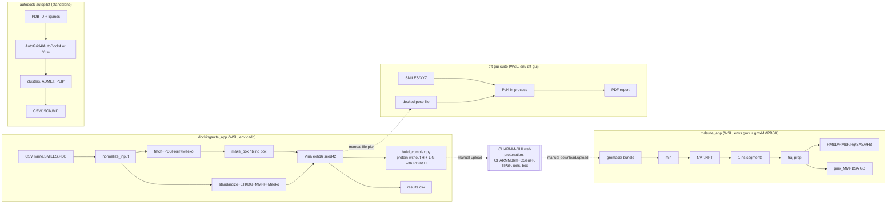
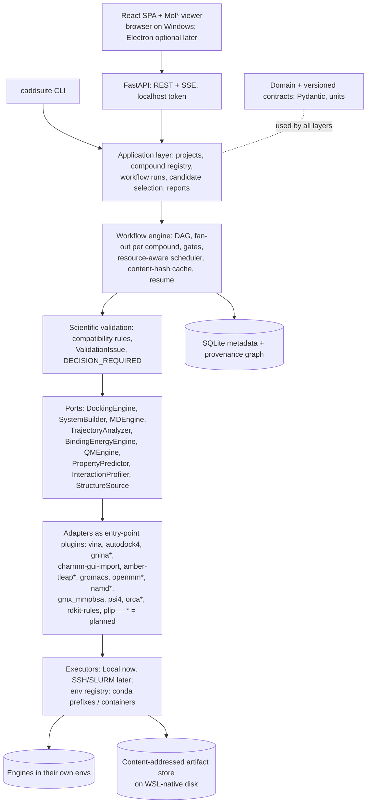

# Architecture Audit — Existing Docking, MD, DFT and AutoDock Applications

| | |
|---|---|
| **Phase** | 0 — Repository audit (no existing code was modified) |
| **Date** | 2026-09-23 |
| **Audited source** | `C:\Users\sridhar\OneDrive\Documents\Suites\` (4 codebases) |
| **Running copies** | WSL2 Ubuntu `~/dockingsuite_app`, `~/mdsuite_app`, `~/dft-gui-suite` — verified byte-identical to `Suites/` (`diff -rq`, excluding outputs) |
| **Method** | Every source file was read in full. Findings were then checked against the *installed* conda environments and the *real project data* in WSL (`~/mdsuite_data`, `~/dockingsuite_data`) using read-only probe scripts (Appendix A). |

**Evidence convention.** `Suites/<app>/<path>:<line>` points at the audited source. Each finding carries a status:

- **Confirmed (code)**: the code path is unambiguous. It has not yet been reproduced by an automated test.
- **Confirmed (data)**: observed in real outputs on this machine.
- **Suspected**: plausible from the code, to be verified by a test before it is fixed.

Severity measures scientific impact: **High** means the platform could produce a wrong number or a wrong conclusion *without any error*.

---

## 0. Executive summary

You have **four** independent applications, not three. The fourth, `autodock-autopilot-main`, appeared in `Suites/` during the audit. Together they hold about **10,500 lines of Python, 3,000 lines of Bash and 600 lines of HTML/JS**. They are real scientific assets. Their code comments hold a lot of hard-won operational knowledge, for example the GROMACS progress-log formats, the CRLF-in-`.mdp` corruption, stale OpenMPI session state, the anion SCF needing diffuse functions for Fukui f⁺, and NMR model-1 extraction. All of that must be preserved.

They are, however, **four separate architectures**:

| App | Architecture | Runtime |
|---|---|---|
| `dft-gui-suite` | PyQt5 desktop app, Psi4 **in-process** in a `QThread` | WSL, conda env `dft-gui` (Py 3.10) |
| `dockingsuite_app` | Bash orchestration + small Python tools + localhost web dashboard | WSL, conda env `cadd` (Py 3.11) |
| `mdsuite_app` | Bash orchestration (GROMACS, gmx_MMPBSA) + localhost web dashboard | WSL, conda envs `gmx` (GROMACS 2026.3) + `gmxMMPBSA` (Py 3.9) |
| `autodock-autopilot-main` | Python package (CLI + PyQt6 GUI via `QProcess`), AutoDock4/Vina, ADMET rules, PLIP | Written for Windows/Docker; not installed in WSL |

They share **no code, no data model, no identity scheme and no provenance**. Today they connect only by hand:

- **Docking → MD:** `<id>_complex.pdb` is uploaded manually to the **CHARMM-GUI web service**. CHARMM-GUI does the protonation, parameterization (CHARMM36m/CGenFF) and solvation. The GROMACS bundle is downloaded and uploaded again into `~/mdsuite_data/projects/<name>/gromacs/`. The only link between a docking pose and its MD system is the project's *name* (e.g. `5NIU_LIG`).
- **Docking → DFT:** a pose file is chosen in the DFT GUI's file picker. The pose's chemical identity is then re-derived from the file.
- **MD ↔ DFT:** no connection. RESP charges are computed at HF/6-31G\* but nothing uses them. They would also be inconsistent with the CGenFF parameters the MD systems actually use.

### Top findings (full list in §8–§11)

| ID | Sev. | Finding | Status |
|---|---|---|---|
| SCI-01 | High (latent) | MM-GBSA runs with **hard-coded index groups `-cg 1 13`**, although the same codebase documents that the ligand group index varies by project (13 vs 19). | Confirmed (code). **All 4 existing MM-GBSA results checked: LIG = group 13, so no existing result is affected.** |
| SCI-02 | High | **Psi4 global options leak between jobs** in one GUI session. `ddx` is never reset, so a gas-phase job run after a solvent job is silently computed in PCM while the report says "Gas phase". | Confirmed (code) |
| SCI-03 | High | Docked-pose **heavy-atom RMSD assigns coordinates by index** from the input-SMILES atom order onto a molecule rebuilt from the *canonical* SMILES, and never checks elements. Strain energy is stored *before* identity checks run. | Confirmed (code) |
| SCI-04 | High | **`gmx grompp -maxwarn 100`** on minimization and every production segment suppresses every grompp warning (net charge, cut-off/PME problems, …). | Confirmed (code) |
| SCI-05 | Med-High | **Blind-docking fallback results share one ranking with pocket-targeted results** and carry no flag. One box is 116 × 53 × 39 Å (about 240,000 ų) at exhaustiveness 16. | Confirmed (data) |
| SCI-06 | Med-High | "Ligand RMSD" is computed **after least-squares fitting on the ligand itself**. It measures internal flexibility, not pose stability, so a ligand drifting out of the pocket can still show a low value. | Confirmed (code) |
| SCI-07 | Medium | `mmpbsa.in` hard-codes **310 K** while every MD run used **303.15 K**. | Confirmed (data, 8/8 projects) |
| SCI-09/10 | Medium | **Three different ligand protonation/standardization policies**: docking neutralizes (`Uncharger`), autopilot protonates with OpenBabel at pH 7.4, DFT does nothing. 153 of 156 rows in your docking test set are covalent `[Na]` salts, so the same SMILES becomes a *different chemical species* in each app. | Confirmed (code + data) |
| ARCH-03 | High (repro) | **Resume and caching are keyed on file existence, not on input or parameter content.** Changing a SMILES, box or exhaustiveness and resuming silently reuses stale results. | Confirmed (code) |
| ARCH-07 | High (repro) | **No provenance.** Results carry no software versions, parameters or input hashes. Real consequence: two MD projects ran on GROMACS **2025.1** and the others on **2026.3**, and that is only recoverable by grepping raw `.log` files. | Confirmed (data) |

### Recommendation in one paragraph

Build a **Linux-hosted (WSL2 today, HPC later) Python core** around four ideas:

- **Engine-independent domain contracts:** versioned Pydantic schemas with explicit units.
- **Ports & adapters:** adapters *plan* commands and *normalize* outputs, while executors *run* them.
- **Process-isolated engine workers:** the engines live in four conda environments with incompatible Pythons, so they cannot share a process.
- **Content-addressed provenance store:** SQLite for metadata, a hashed artifact store on WSL-native disk for files.

Migrate incrementally in strangler-fig style. First extract the proven pure scientific functions and lock them down with golden tests built from *your own existing results*. Then re-express the Bash orchestration as adapters plus a small in-house workflow engine. Make scientific compatibility checks, including every finding in this audit, first-class validators so fixed bugs cannot silently return. Details are in `docs/architecture/`.

---

## 1. Repository structure summary

```
Suites/
├── dft-gui-suite/            3,161 py · 110 sh · README 238
│   ├── core/                 GUI-free science: dft_runner, molecule_io, batch_runner, cube_engine,
│   │                         isosurface, figure_style, descriptors, pose_analysis, report_builder,
│   │                         package_builder
│   ├── gui/main_gui.py       PyQt5 (Setup&Run / Results / Batch tabs)
│   ├── examples/             water.xyz, batch_ligands.csv
│   ├── outputs/              60 files of real results (psi4.out, result.json, PDF, PNG, ZIP, resp/)
│   ├── environment.yml       unpinned
│   └── setup_wsl.sh, run_dft.sh, timer.dat (stray Psi4 timer file)
├── dockingsuite_app/         895 py · 812 sh · 265 html · README 129
│   ├── bin/                  dockapp (CLI), dock_ctl/dock_run/queue_ctl/lib_common/doctor/install (bash),
│   │                         fetch_receptor, prep_receptor, prep_ligand, make_box, build_complex,
│   │                         collect_scores, normalize_input, dockapp_web (python)
│   ├── web/index.html        dashboard
│   ├── projects/_template/project.conf
│   └── smoke_test.csv, "Test Docking.csv" (52 compounds × 3 receptors)
├── mdsuite_app/              754 py · 2,057 sh · 324 html · README 234
│   ├── bin/                  mdsuite (CLI), md_ctl/md_run_segment, traj_ctl/traj_prep_run,
│   │                         analyze_ctl/analyze_run, mmpbsa_ctl/mmpbsa_run, compare_ctl,
│   │                         queue_ctl, lib_common, doctor, install (bash);
│   │                         plot_traj_analysis, compare_run, mdsuite_web (python)
│   ├── web/index.html
│   └── projects/_template/project.conf
└── autodock-autopilot-main/  5,689 py · README 303 · NO LICENSE FILE
    ├── main.py, run_gui.py, core/pipeline.py
    ├── preparation/          receptor_prep, ligand_prep
    ├── docking/              grid_generator (AutoGrid4), autodock4_runner, vina_runner
    ├── analysis/             cluster_analysis, interactions (PLIP + fallback), admet, reporting
    ├── config/               config_manager + default_config.yaml (paper protocol, 4GGL/CJC), vina_windows.yaml
    ├── utils/                downloader (RCSB/PubChem/ChEMBL/AlphaFold), file_utils (tool discovery),
    │                         structure_utils, logger, errors
    ├── gui/main_window.py    PyQt6, runs main.py via QProcess
    ├── tests/test_smoke.py   the ONLY automated tests across all four codebases
    ├── bin/vina.exe          bundled Windows binary (sha256 b5a23b22…0b38f), provenance unknown
    └── Dockerfile, environment.yml, requirements.txt
```

**Host environment (probed):** Windows 11 with WSL2 Ubuntu (kernel 6.18), 16 logical CPUs, **7 GB RAM visible to WSL**, NVIDIA RTX 5050 Laptop (8 GB, driver 591.44). Conda 26.5.3 with envs `cadd`, `gmx`, `gmxMMPBSA`, `dft-gui`, `psi4`, `deepdock`. Also present but outside the audit scope: **NAMD 3.0.3 multicore-CUDA** and `~/NAMD_projects/` (`7taa_lig12`, `NAMD_md1`), VMD 2.0.1a1, a GROMACS 2024.2 source tree, and the original thesis scripts (`pparg_*_ctl.sh`). The Windows side has Python 3.12.10, Node 24.19, git 2.55.

---

## 2. Application inventory

### 2.1 DFT — `dft-gui-suite`

| Aspect | Detail |
|---|---|
| **Purpose** | Molecular DFT (Psi4) for small molecules / ligands with a publication-style PDF report and a batch mode. |
| **Entry points** | `run_dft.sh` → `gui/main_gui.py:main()`. Headless: `core.batch_runner.run_batch()` / `core.dft_runner.run_dft_job()` (README §4). |
| **Inputs** | SMILES (single / pasted list), `.xyz`, batch CSV (`name,smiles|xyz,charge,multiplicity`), optional docked pose (`.pdb/.mol2/.sdf`). |
| **Outputs** | `outputs/<job>.psi4.out`, `<job>.result.json` (serialized `DFTResult`), PNG figures (FMO, MEP, Fukui ±, pose overlay), `<job>_resp/`, PDF report, client ZIP, batch summary CSV. Temporary cube files are deleted unless `keep_cubes`. |
| **Calculations** | energy / optimize / frequency / opt+freq; implicit solvation (ddX-PCM, 10 solvents); Mulliken/Löwdin/MBIS charges; RESP (independent HF/6-31G\* fit); TD-DFT singlets; HOMO/LUMO/gap; conceptual-DFT descriptors (Koopmans); cube-based HOMO/LUMO isosurfaces and MEP; Fukui f⁺/f⁻ by finite difference (diffuse basis for the anion leg); docked-pose strain energy + symmetry-aware heavy-atom RMSD; IR spectrum and thermochemistry with an imaginary-frequency check. |
| **Dependencies (installed)** | psi4 1.11, rdkit 2026.03.5, numpy 2.2.6, scipy 1.15.2, pyvista 0.48.4, scikit-image 0.25.2, reportlab 5.0.1, pyqt 5.15.11, pyddx 0.7.0, dftd3-python 1.5.0, resp 1.0.0 (Python 3.10). |
| **Configuration** | GUI widgets → `DFTJobConfig` dataclass (`core/dft_runner.py:31-52`). Menu lists are hard-coded (`gui/main_gui.py:30-38`, `core/dft_runner.py:25-28`). `output_dir="./outputs"` is relative to the CWD (`gui/main_gui.py:418`). |
| **Internal data** | `DFTJobConfig`, `DFTResult`, `BatchRow` dataclasses. `DFTResult` is serialized to JSON **without a schema version and without the config** (charge, multiplicity, n_conformers, seed, input SMILES are not in the result). |
| **External calls** | Psi4 Python API **in-process**; RDKit; `resp` plugin (changes CWD with `os.chdir`); PyVista offscreen. |
| **Error handling** | `run_dft_job` never raises. It returns `success=False` and a traceback. Sub-steps (dipole, charges, TD-DFT, figures, Fukui, pose) each swallow their own exceptions into the log while the job stays `success=True`, so partial results can only be told apart by `None` fields. |
| **Logging** | GUI log pane via callback; Psi4 `.out`; no structured log. |
| **Tests** | None. The README says features were validated manually against Psi4 1.11. |
| **Strengths** | Real core/GUI separation (core is headless-scriptable); plain-data config/result objects (a proto data contract); scientifically careful choices, each explained in comments: diffuse basis for the anion leg (`core/cube_engine.py:29-56`), follow-up single point after `frequency()` for orbital energies (`core/dft_runner.py:197-207`), RESP option clearing (`:263-269`), 2D-pose and corrupted-element detection (`core/pose_analysis.py:52-67`), imaginary-mode reporting. |

### 2.2 Docking — `dockingsuite_app`

| Aspect | Detail |
|---|---|
| **Purpose** | Unattended AutoDock Vina screening of a CSV (`name, SMILES, PDB ID`) across multiple client projects, resumable, one run at a time system-wide. |
| **Entry points** | `dockapp {add,list,dock status|resume|stop,queue …,doctor,gui}` → `dock_ctl.sh` → `queue_ctl.sh enqueue` → `nohup dock_run.sh`. Web: `dockapp_web.py` (127.0.0.1:8766). |
| **Inputs** | CSV/TXT with flexible headers (`normalize_input.py:27-31`); PDB IDs fetched from RCSB; optional hand-written `receptors/<ID>/box.txt`. |
| **Outputs** | Per receptor: `raw.pdb`, `receptor_raw.pdb`, `receptor_clean.pdb`, `receptor.pdbqt`, `ref_ligand.pdb`, `box.txt`. Per ligand: `ligand.sdf/.pdbqt/.smi`. Per job: `<id>_poses.pdbqt/.sdf`, `<id>_best.sdf/.pdb`, `<id>_complex.pdb`, `vina.log`. Per project: `results.csv` (score, heavy atoms, LE), `dock_master.log`. |
| **Workflow** | normalize CSV → per unique PDB: fetch, split protein/HETATM, keep model 1, pick the reference ligand (largest non-excluded HETATM) → PDBFixer (pH 7.4) → Meeko receptor PDBQT (obabel `-xr` fallback) → box from the reference ligand (5 Å padding, 22 Å floor) **or whole-protein blind box** → per ligand: RDKit standardize (MetalDisconnector → LargestFragment → Uncharger) → ETKDGv3 (seed 42) + MMFF → Meeko PDBQT → Vina (exh 16, 9 modes, seed 42, all cores) → obabel SDF/PDB → **complex rebuild with bond orders from the SMILES template** (coordinate transfer verified to ≤1e-4 Å) → collect scores + LE. |
| **Dependencies (installed)** | vina 1.2.7, meeko 0.7.1, rdkit 2025.03.6, openbabel 3.1.1, pdbfixer 1.12.0, openmm 8.4.0, numpy 2.4.6 (Python 3.11); network access to RCSB. |
| **Configuration** | `project.conf` is **sourced as Bash** (`bin/lib_common.sh:44-47`). Defaults live in `load_project_conf` (`:37-43`). `box.txt` is also sourced (`bin/dock_run.sh:174`). Environment variables: `DOCKSUITE_DATA_ROOT`, `CADD_ENV_NAME`. |
| **Internal data** | Filesystem state plus CSVs (`jobs.csv`, `results.csv`), `key = value` `box.txt`, PID files, a `.dock_done` marker. |
| **Error handling** | Per-ligand failures are logged and skipped. **Any receptor-prep failure is FATAL for the entire project** (`bin/dock_run.sh:78-80` via `run()`). |
| **Logging** | `dock_master.log` (timestamped `log_line` plus raw tool output); per-job `vina.log`. |
| **Tests** | None (`smoke_test.csv` is a manual input). |
| **Strengths** | Salt handling; bond-order-correct complex rebuild with a fidelity check (`bin/build_complex.py:55-87`); NMR model-1 handling (`bin/fetch_receptor.py:64-79`); loud blind-docking fallback log; self-describing output filenames; the web layer validates project names and escapes HTML. |

### 2.3 MD — `mdsuite_app`

| Aspect | Detail |
|---|---|
| **Purpose** | Everything *after* CHARMM-GUI: minimization, equilibration, segmented GROMACS production, trajectory preparation, analyses (RMSD/RMSF/Rg/SASA/H-bonds/contacts), two-project comparison, MM-GBSA (gmx_MMPBSA). |
| **Entry points** | `mdsuite {add,list,md,traj,analyze,compare,mmpbsa,queue,doctor,gui}` → `*_ctl.sh` → `queue_ctl.sh` → `nohup *_run.sh`. Web: `mdsuite_web.py` (127.0.0.1:8765; exposes md/traj/mmpbsa but **not** analyze/compare). |
| **Inputs** | CHARMM-GUI GROMACS bundle: `step3_input.gro`, `step4.0_minimization.mdp`, `step4.1_equilibration.mdp`, `step5_production.mdp`, `topol.top`, `index.ndx`, `toppar/`. Verified: all systems are **CHARMM FF via CHARMM-GUI FF-Converter** with `vdw-modifier = Force-switch`, TIP3P, POT/CLA/SOD ions, ligand `LIG.itp` (or `UNL.itp`). |
| **Outputs** | `step4.*`, `step5_<n>.{tpr,gro,cpt,xtc,edr,log}`, `analysis/{analysis.ndx, combined_raw|nojump|fit.xtc, mmpbsa.in, FINAL_RESULTS_MMGBSA.dat/.csv, *.xvg, *.csv, plot_*.png}`, comparison PNGs, master logs. |
| **Workflow** | grompp/mdrun minimization (`gmx_d` if present) → NVT/NPT equilibration → production in segments (nsteps from the `.mdp`, treated as 1 ns) chained through `-t prev.cpt` exactly as CHARMM-GUI's README does → `make_ndx` baseline → ligand auto-detection by elimination against a solvent/ion regex, verified by atom count → `trjcat -settime` → `trjconv -pbc nojump` → fit rot+trans on Protein → `mmpbsa.in` (GB, igb=5, 150 mM, full trajectory) → `mpirun gmx_MMPBSA` with a stale-MPI retry → analyses plus plots (20 ns warm-up excluded from summary statistics). |
| **Dependencies (installed)** | GROMACS 2026.3 (conda-forge CUDA, no MPI; older projects ran on 2025.1), gmx_MMPBSA 1.6.3, AmberTools 23.6, ParmEd 4.3.0, OpenMPI 5.0.10 (Python 3.9), matplotlib; **CHARMM-GUI (web, manual)**. |
| **Configuration** | `project.conf` (Bash, sourced): TARGET_NS, NCORES, OMP_THREADS, GPU_DEVICE; the CHARMM-GUI `.mdp` files carry the physics. Hard-coded: GPU mdrun flags, the MM-GBSA method block, the solvent regex, the warm-up window. |
| **Error handling** | `run()` is FATAL on any failed command; pre-flight checks for MM-GBSA inputs; success requires parsed `[ERROR] = 0` plus "Finalized" plus a non-empty CSV (`bin/mmpbsa_run.sh:117-126`). This is careful work. |
| **Logging** | Per-stage master logs; GROMACS/gmx_MMPBSA output captured raw; progress/ETA parsing in the ctl scripts. |
| **Tests** | None. |
| **Strengths** | Resumable segments; atomic temp-file-then-rename for trajectory stages with extension-aware temp names (`bin/traj_prep_run.sh:163-184`); LIG group verification (`:144-160`); pinned GROMACS binary after a real version-mismatch crash (`:37-46`); CRLF stripping (`bin/md_ctl.sh:84-92`); PID-file (not `pgrep`) process tracking; `PYTHONUNBUFFERED` through `mpirun -x`. |

### 2.4 AutoDock pipeline — `autodock-autopilot-main`

| Aspect | Detail |
|---|---|
| **Purpose** | Reproduces an AutoDock4 LGA protocol from a published study (README: *Folia Microbiologica*, 4GGL/CJC, 300 GA runs, 40×40×40 grid, re-docking RMSD validation), plus Vina, ADMET-style descriptors, and PLIP interactions. |
| **Provenance** | README links point to `c:/Users/Admin/Desktop/autodock_vina_cluster_automation/…`, the credit reads "AutoDock Autopilot Team", and there is **no LICENSE file**. Authorship is unknown to this audit (**question Q1**). |
| **Entry points** | `main.py` (argparse or YAML config) → `core.pipeline.DockingPipeline.run()`. `run_gui.py` → PyQt6 `MainWindow`, which writes a YAML config and runs `main.py` through **`QProcess`** (clean process isolation; Cancel means kill). |
| **Inputs** | Receptor from RCSB ID or file; ligands from SMILES/SDF/MOL2/PDB/SMI files or directories, PubChem CIDs, ChEMBL IDs; YAML config. |
| **Outputs** | `outputs/{pdbqt,grids,results/{autodock4,vina,interactions},structures,plots,logs}`, `results.json`, `summary.csv`, `clusters.csv`, `report.md`, `.gui_run_config.yaml` (the config is saved with the run, which is good practice). |
| **Workflow** | preflight tool discovery → receptor clean (first model, altloc A, strip HETATM) → obabel `-p 7.4` protonation (reduce fallback) → MGLTools/obabel PDBQT → grid centre from the first co-crystal instance (or protein Cα centroid) → ligand 3D (RDKit, obabel fallback) → obabel pH protonation → PDBQT → AutoGrid4 (receptor types parsed from the actual PDBQT) → AutoDock4 DPF/DLG **or** Vina (threaded, 1 CPU each) → cluster/LE/Kᵢ → optional re-dock validation → ADMET rules → PLIP (distance fallback) → reports. |
| **Dependencies** | Declared, unpinned: rdkit, openbabel, autodock/autogrid4, vina, mgltools (Python 2), plip, PyQt6, pyyaml, numpy, matplotlib. |
| **Error handling** | `PipelineUserError` gives clean user-facing errors, which is a good pattern. **But fallbacks "degrade gracefully" into physically meaningless inputs** (SCI-12). |
| **Tests** | `tests/test_smoke.py`: offline tests for the DLG parser (three realistic format variants), cluster/LE, ADMET, ligand prep, reporting and config. Good fixtures for a future AutoDock4 adapter. |
| **Strengths** | Only ADMET, PLIP and AutoDock4 code in the portfolio; typed tool discovery with explicit overrides; `run_command` uses argument lists (no shell); AutoGrid receptor types parsed from the file; multi-copy co-crystal warning; clear user errors; config persisted per run. |

---

## 3. Existing workflow mapping

### 3.1 As-is end-to-end flow



### 3.2 Interfaces between stages, as they actually exist

| Seam | Artifact crossing | Identity carried | Validation at the seam |
|---|---|---|---|
| Docking → MD | `<name>__<PDB>_complex.pdb`: protein heavy atoms (H stripped, `build_complex.py:124-125`) plus the ligand as `LIG` with RDKit-added H, **neutral form** | Name convention only (`5NIU_LIG`, `BJ3V__LIG`) | None. CHARMM-GUI re-perceives the chemistry; its choices (protonation, CGenFF penalty scores) are not captured |
| CHARMM-GUI → MD | GROMACS bundle (`.gro/.top/.itp/.mdp/.ndx`) | Folder name | Existence checks only |
| MD traj → MM-GBSA | `combined_fit.xtc`, `analysis.ndx`, `step5_1.tpr`, `topol.top` | Folder | LIG atom count verified (good), **but MM-GBSA ignores it and uses group 13** (SCI-01) |
| Docking → DFT | pose `.pdb/.mol2/.sdf` via file picker | SMILES re-derived from the pose | Atom-count check only (SCI-03) |
| DFT → MD | RESP charges in `result.json` | none | Not consumed. Inconsistent with CGenFF in any case (§4.3) |
| Any → report | Each app has its own report (PDF / PNG+CSV / Markdown) | job/project name | Disclaimers exist in DFT and autopilot only |

### 3.3 Candidate identity today

There is no compound registry, and nothing links `CMP001`'s pose, MD system and DFT job:

- **Docking:** `safe_id = sanitize(name)__sanitize(pdb_id)`, de-duplicated by counter (`normalize_input.py:69-74`).
- **DFT:** `job_name` is free text or `batch_<sanitized name>` (`batch_runner.py:150`), with a different sanitizer regex from docking.
- **MD:** the project name is whatever the user typed.
- **autopilot:** `safe_filename(stem)[:80]` (`utils/file_utils.py:188-192`). Name collisions silently reuse cached files (`ligand_prep.py:278-280`).

---

## 4. Dependency mapping

### 4.1 Environments (installed versions, from `conda-meta`)

| Env | Python | Key packages | Used by |
|---|---|---|---|
| `cadd` | 3.11.15 | rdkit 2025.03.6, openbabel 3.1.1, vina 1.2.7, meeko 0.7.1, pdbfixer 1.12.0, openmm 8.4.0, pyqt 5.15.11 | docking |
| `gmx` | 3.12.13 | gromacs 2026.3 (conda-forge, CUDA, nompi; `bin.AVX2_256` etc.) | MD |
| `gmxMMPBSA` | 3.9.23 | gmx_MMPBSA 1.6.3, ambertools 23.6, parmed 4.3.0, openmpi 5.0.10, numpy 1.26.4 | MM-GBSA, plotting |
| `dft-gui` | 3.10.20 | psi4 1.11, rdkit 2026.03.5, pyvista 0.48.4, pyddx 0.7.0, resp 1.0.0, pyqt 5.15.11 | DFT |
| `psi4`, `deepdock` | — | not referenced by the audited code | — |
| *(none)* | — | autodock4/autogrid4, MGLTools, PLIP, PyQt6 are **not installed** in WSL | autopilot |

**Consequence:** four mutually incompatible interpreters (3.9 / 3.10 / 3.11 / 3.12). No single Python process can import all the engines. This is the main driver for ADR-0002 (process-isolated workers).

**Version drift that can change results:** RDKit 2025.03.6 (docking) vs 2026.03.5 (DFT). Canonical SMILES, standardizer and ETKDG behaviour can differ between RDKit releases, so the "same" ligand can differ between apps.

### 4.2 External services

RCSB (`files.rcsb.org`, `data.rcsb.org`), PubChem PUG-REST, ChEMBL REST, AlphaFold DB (URL hard-codes `model_v4`, `utils/downloader.py:209-210`), and **CHARMM-GUI** (manual, server-side versioned, not reproducible offline).

### 4.3 Licensing (from package metadata where installed; otherwise from upstream, to verify in Phase 18)

| Component | License | Notes for the platform |
|---|---|---|
| Psi4 1.11 | LGPL-3.0 (+BSD/MIT parts) | Call as a user-installed engine |
| RDKit | BSD-3 | Safe to depend on |
| Open Babel 3.1.1 | **GPL-2.0-only** | Invoke as an external CLI; do not link or bundle into a non-GPL distribution |
| AutoDock Vina 1.2.7 | Apache-2.0 | |
| Meeko 0.7.1 | LGPL-2.1+ | |
| PDBFixer / OpenMM 8.4 | MIT / LGPL-3.0+ | |
| GROMACS 2026.3 | LGPL-2.1+ | |
| gmx_MMPBSA 1.6.3 | **GPL-3.0** | External tool |
| AmberTools 23.6 | GPL-3.0 + LGPL-3.0 + BSD + MIT | |
| ParmEd 4.3 | LGPL-2.1+ | |
| PyQt5 5.15 (and PyQt6) | **GPL-3.0** (or commercial) | Matters if a GUI is ever *distributed*; a web UI avoids it |
| reportlab, PyVista, scikit-image, SciPy, NumPy | BSD / MIT | |
| dftd3-python, pyddx | LGPL-3.0+ | |
| AutoDock4 / AutoGrid4, MGLTools, PLIP | to verify (AutoDock4 and PLIP are GPL-family upstream; MGLTools has its own license) | autopilot only |
| **CHARMM-GUI** (web), **CGenFF** program | Academic/non-profit use free; **commercial use needs a license** | Your projects are described as *client* projects → **question Q2** |
| NAMD 3.0.3, VMD | UIUC non-commercial license | Same question |
| ORCA / Gaussian (future) | Academic registration / commercial | Must remain user-installed; never bundled |
| `autodock-autopilot-main` itself | **No license file** | If third-party, code cannot be copied into the platform without permission (Q1) |

---

## 5. Hard-coded assumptions

| Category | Assumption | Where |
|---|---|---|
| Paths / env | `~/miniconda3` layout; env names `cadd`, `gmx`, `gmxMMPBSA`, `dft-gui` | `dockingsuite_app/bin/lib_common.sh:68-69`, `mdsuite_app/bin/mmpbsa_run.sh:70-72`, `dft-gui-suite/run_dft.sh:7-8` |
| Paths / env | GROMACS at `~/miniconda3/envs/gmx/bin.AVX2_256`, else **first `gmx` found by `find $HOME -maxdepth 6`** | `mdsuite_app/bin/md_run_segment.sh:66-71` (and 3 copies) |
| Paths / env | Docs point to `/mnt/c/Users/sridh/OneDrive/Desktop/...` (stale username/location) | both READMEs, `install.sh:3` |
| Paths / env | DFT outputs to CWD-relative `./outputs` | `dft-gui-suite/gui/main_gui.py:418` |
| Hardware | mdrun `-nb gpu -bonded gpu -pme gpu -update gpu` always | `md_run_segment.sh:151-153,189-192` |
| Hardware | Vina `--cpu $(nproc)` per job, sequential jobs | `dockingsuite_app/bin/lib_common.sh:42` |
| Hardware | `mpirun --use-hwthread-cpus -np NCORES` (default 16) with 7 GB RAM | `mmpbsa_run.sh:95` |
| Hardware | Psi4 defaults 5 GB / 8 threads | `core/dft_runner.py:39-40` |
| Science | Production segment = **1 ns** (nsteps assumed to be steps per ns; trjcat offsets `i*1000` ps; frames per segment = 1000/frame_ps) | `md_run_segment.sh:96`, `traj_prep_run.sh:176,219` |
| Science | MM-GBSA: igb=5, saltcon 0.150, **temperature 310**, full trajectory, interval 1, no entropy, no decomposition | `traj_prep_run.sh:221-241` |
| Science | MM-GBSA groups `-cg 1 13` | `mmpbsa_run.sh:96` |
| Science | Analysis warm-up 20 ns; fixed make_ndx group numbers 1/3/4 | `analyze_run.sh:32,88-123` |
| Science | Solvent/ion residue whitelist (CHARMM names) defines "the ligand" by elimination | `traj_prep_run.sh:106` |
| Science | Vina exhaustiveness 16, 9 modes, seed 42; box pad 5 Å, floor 22 Å | `dockingsuite_app/bin/lib_common.sh:37-43` |
| Science | Receptor pH 7.4; ligands neutralized | `prep_receptor.py:18`, `prep_ligand.py:34-41` |
| Science | Reference ligand = largest HETATM not on the exclusion list | `fetch_receptor.py:30-38,108` |
| Science | RESP always HF/6-31G\*; Fukui iso 0.003; MEP range ±0.05 au; grid spacings per quality tier | `dft_runner.py:258-283`, `figure_style.py:23-27`, `cube_engine.py:23-27` |
| Science | autopilot: 40×40×40 grid @0.375 Å (15 Å Vina box), 300 GA runs, `seed pid time`, Kᵢ at 298.15 K | `config/config_manager.py:35-55`, `autodock4_runner.py:192`, `cluster_analysis.py:113-115` |
| Engine | GROMACS command sequence, CHARMM-GUI file names (`step3_input.gro`, `step5_production.mdp`, …) | `md_run_segment.sh` |
| Engine | Psi4-specific options (`ddx`, `save_jk`, `CUBEPROP_*`) inside the "DFT runner" | `dft_runner.py:124-136`, `cube_engine.py` |
| Engine | "Docking" ≡ Vina + Meeko PDBQT; "complex" built from PDBQT via obabel | `dock_run.sh`, `build_complex.py:45-52` |
| Naming | Ligand residue name `LIG`; chain letter auto-picked; `safe_id` = identity | `build_complex.py:111,138` |

---

## 6. Reusable components (what to preserve)

Reuse modes: **Lift** (move as-is, add tests) · **Lift+Fix** (move, then fix the cited finding) · **Re-express** (keep the protocol, rewrite the orchestration) · **Reference** (keep for comparison only).

| Component | Source | Value | Target module | Mode |
|---|---|---|---|---|
| Salt stripping + neutralization pipeline | `dockingsuite_app/bin/prep_ligand.py:34-41` | Handles covalent `[Na]` salts (153/156 test rows) | `chem.standardize` (policy-driven; protonation becomes a separate, explicit step) | Lift+Fix (SCI-09) |
| ETKDGv3 + MMFF/UFF embed, multi-conformer lowest-energy pick | `dft-gui-suite/core/molecule_io.py:25-90`, `prep_ligand.py:44-62` | Seeded, reproducible 3D | `chem.embed` (one implementation) | Lift (merge) |
| Flexible CSV header aliasing + safe IDs | `normalize_input.py:23-45`, `batch_runner.py:20-99` | Accepts messy user files | `registry.import_compounds` | Lift (merge) |
| RCSB fetch, model-1 extraction, HETATM exclusion set, multi-copy warning | `fetch_receptor.py`, `autopilot/preparation/receptor_prep.py:96-187`, `utils/structure_utils.py` | Robust receptor intake | `structure.fetch`, `structure.split` | Lift+Fix (SCI-11, SCI-24) |
| PDBFixer receptor protocol (internal gaps only, pH) | `prep_receptor.py` | Proven cleaning | `structure.prepare_protein` | Lift+Fix (keep SEQRES) |
| Box from reference ligand, pad + floor; autopilot `suggest_grid_npts` | `make_box.py`, `structure_utils.py:67-94` | Binding-site definition | `structure.binding_site` | Lift+Fix (SCI-16) |
| **Bond-order-correct complex rebuild** from a SMILES template with a coordinate-fidelity check; column-exact PDB writer | `build_complex.py:55-108` | The critical Docking→MD step | `structure.complex_builder` | Lift (no `shell=True`) |
| Vina result parsing (REMARK VINA RESULT), LE | `collect_scores.py:30-58` | | `adapters.docking.vina.normalize` | Lift |
| AutoDock4 DPF/GPF writers and **DLG parser**, Kᵢ conversion, plus their tests | `autodock4_runner.py`, `grid_generator.py`, `tests/test_smoke.py` | AutoDock4 adapter almost for free | `adapters.docking.autodock4` | Lift+Fix (SCI-13/14), pending Q1 |
| Tool discovery with overrides | `autopilot/utils/file_utils.py:46-158` | Pattern for engine discovery | `execution.env_registry` | Re-express (no Downloads/Desktop globbing) |
| Psi4 protocol: calc types, follow-up SP after freq, ddX solvation, populations, RESP, TD-DFT, cubes, Fukui (diffuse anion), pose strain | `core/dft_runner.py` | Validated QC recipe | `workers/psi4_worker.py` (engine side) + `adapters.qm.psi4` | Re-express (process-isolated), Fix SCI-02/03/20 |
| Cube parsing, isosurfaces (FMO, MEP, Fukui), shared camera/palette | `core/cube_engine.py:59-90`, `core/isosurface.py`, `core/figure_style.py` | **Engine-independent** (ORCA and Gaussian also emit cubes) | `analysis.volumetric`, `viz.render` | Lift (+negative-natoms support) |
| Conceptual-DFT descriptors | `core/descriptors.py` | Pure function | `analysis.qm_descriptors` | Lift |
| Pose loading with 2D/corrupted-element detection, symmetry-aware RMSD | `core/pose_analysis.py` | | `analysis.pose` | Lift+Fix (SCI-03) |
| Report building blocks (tables, spectra, UV-Vis/IR broadening, methods paragraph generated from config) | `core/report_builder.py` | "Methods text cannot drift from what ran" | `reporting.sections.qm` | Re-express |
| Client ZIP bundling | `core/package_builder.py` | Seed of the reproducibility package | `storage.export` | Re-express |
| GROMACS protocol (CHARMM-GUI README sequence, `-r` choices, segment chaining) | `md_run_segment.sh` | Proven production protocol | `adapters.md.gromacs.plan` | Re-express (Fix SCI-04/18) |
| GROMACS/gmx_MMPBSA **progress and ETA parsing** | `md_ctl.sh:92-165`, `mmpbsa_ctl.sh:41-167` | Real log formats captured | `adapters.*.progress()` | Re-express (Python) |
| Ligand-group auto-detection + verification | `traj_prep_run.sh:69-161` | | `analysis.selection` (MDAnalysis-based, engine-independent) | Re-express |
| Trajectory prep (concat, PBC, fit) with atomic temp files | `traj_prep_run.sh:163-204` | | `adapters.md.gromacs.trajectory` | Re-express (Fix SCI-19) |
| gmx_MMPBSA runner with stale-MPI retry and strict success parsing | `mmpbsa_run.sh` | | `adapters.binding_energy.gmx_mmpbsa` | Re-express (Fix SCI-01/07, SEC-06) |
| RMSD/RMSF/Rg/SASA/H-bond/contact analyses, warm-up-aware stats, dual plots | `analyze_run.sh`, `plot_traj_analysis.py`, `compare_run.py` | | `analysis.trajectory` (MDAnalysis) + `reporting.plots` | Re-express, **cross-validated against the existing gmx outputs** |
| ADMET rules (Ro5/Veber/Ghose/Egan), PAINS/Brenk, QED, ESOL | `autopilot/analysis/admet.py` | Only ADMET code | `adapters.admet.rdkit_rules` | Lift+Fix (SCI-15), pending Q1 |
| PLIP runner + XML parser (+ contact fallback) | `autopilot/analysis/interactions.py` | Only interaction code | `adapters.interactions.plip` | Lift+Fix (SCI-21), pending Q1 |
| `PipelineUserError` pattern | `autopilot/utils/errors.py` | Clean user errors | `core.errors` (expanded taxonomy) | Re-express |

**Operational lessons written into comments — to become tests or validators, not to be lost:** CRLF in `.mdp` corrupts awk parsing; GROMACS progress uses `\r` and two ETA formats; `gmx` via PATH can be the wrong version; gmx tools append `.xtc` to unknown extensions; picking gmx index groups by *name* silently selects the wrong group; OpenMPI/PRRTE stale sessions; Python stdout block-buffering under `mpirun`; `-maxwarn -1` rejected by newer grompp; NMR entries hold 35 MODELs; half-hydrogenated ligand PDBs; the anion SCF converges to a wrong density without diffuse functions; Psi4 `frequency()` wavefunctions lack orbital energies; Psi4 `CHELPG` is a silent no-op in 1.11; RESP is contaminated by lingering solvent options; Vina 1.2 removed `--log`; AutoGrid receptor-type mismatches abort; AD4 RMSD rows are space-delimited in 4.2.6.

---

## 7. Duplicated functionality

| Capability | Implementations (divergences) | Consolidate into |
|---|---|---|
| SMILES → 3D | DFT `molecule_io` (seed 42, UFF fallback, multi-conformer); docking `prep_ligand` (seed, standardizes, no UFF fallback); autopilot `_smiles_to_sdf` (**unseeded**, ETDG fallback, obabel fallback) | `chem.embed` |
| Standardization / protonation | docking: neutralize; autopilot: obabel pH 7.4 (silent failure → unprotonated); DFT: none | `chem.standardize` + `chem.protonation` (explicit policy) |
| CSV import + name sanitizing | three sanitizers with different allowed characters | `registry` |
| RCSB fetch + HETATM detection | docking `fetch_receptor` (exclusion list A) vs autopilot `downloader` + `structure_utils` (list B) + `receptor_prep` | `structure.fetch` (one curated list, as config data) |
| PDBQT preparation | Meeko (docking) vs MGLTools/obabel/"manual" (autopilot) | Engine-family adapter helper (`adapters.docking._autodock_family`) |
| Vina execution + parsing | docking (CLI, seed, sequential, all cores) vs autopilot (threads, 1 CPU each, no seed, stdout table parse) | `adapters.docking.vina` |
| Complex building | docking `build_complex` (template bond orders, strips receptor H) vs autopilot `_build_complex` (raw concatenation) | `structure.complex_builder` |
| Covalent-radius bond perception + CPK colours | DFT `isosurface.py:36-67` and `report_builder.py:30-59` (**different colour tables**) | `viz.style` |
| Tolerant geometry-block parsing | `cube_engine.py:160-181`, `report_builder.py:160-183`, `pose_analysis.py:105-113` | `chem.formats.xyz` |
| Unit constants | `627.5094740631` literal in 3 places; `HARTREE_TO_EV`, `EV_TO_NM` duplicated | `domain.units` |
| Bash infrastructure | `lib_common.sh`, `queue_ctl.sh`, `*_doctor.sh`, `install.sh`, `*_web.py`, `web/index.html` near-duplicated between docking and MD | Replaced by `workflow` + `execution` + `api` |
| Status/progress | bash `status()` functions, and **web dashboards re-implementing them** (`mdsuite_web.py:69-122`) | Single state machine in the DB |
| Ligand efficiency | docking `−score/HA` (positive) vs autopilot `ΔG/HA` (negative) | `analysis.metrics.ligand_efficiency` (one documented convention) |

---

## 8. Scientific risks (severity-ranked)

| ID | Sev. | Finding | Evidence | Status | Remediation |
|---|---|---|---|---|---|
| **SCI-01** | High (latent) | MM-GBSA uses fixed `-cg 1 13`. For multi-residue ligands (documented case: trisaccharide, LIG = 19) or a cofactor or other residue ahead of the ligand, group 13 is **a different molecule**, so ΔG is computed for the wrong ligand with no error. | `mdsuite_app/bin/mmpbsa_run.sh:96` vs `lib_common.sh:84-97`, `analyze_run.sh:74` | Confirmed (code). Data: 2M2D_LIG, 2M2D_STD, 5NIU_LIG, 5NIU_STD all have LIG = 13, so **not affected** | Resolve groups by verified selection; validator `MMGBSA.GROUP_MISMATCH` |
| **SCI-02** | High | Psi4 options are global. `options` sets `ddx` only when a solvent is chosen and never resets it; `save_jk` and `CUBEPROP_*` persist. No `psi4.core.clean_options()`/`clean()`. Jobs run in a `QThread` of one long-lived process, so **gas-phase-after-solvent jobs run in PCM** while `result.solvent == "none"` and the PDF says "Gas phase". | `dft-gui-suite/core/dft_runner.py:111-136`; `gui/main_gui.py:41-58` | Confirmed (code); reproduce in a Phase 10 test | One fresh worker process per job, plus an explicit full option set |
| **SCI-03** | High | Pose RMSD: `_rdkit_mol_from_smiles_and_xyz(docked_smiles, final_geometry)` assigns DFT coordinates (atom order of the **user's** SMILES) by index to a molecule parsed from the **canonical** SMILES of the pose, ignoring element symbols. The RMSD is wrong unless both orders happen to coincide. Separately, the strain energy is computed and stored **before** any identity or formula check (a different protonation state or salt form would be subtracted as if identical). | `core/pose_analysis.py:94-126,140`; `core/dft_runner.py:421-433` | Confirmed (code) | Map atoms by substructure match between the actual input mol and the pose; require an identical formula and charge before computing strain; validator `QM.POSE_IDENTITY` |
| **SCI-04** | High | `-maxwarn 100` on minimization and production grompp hides all warnings; the equilibration grompp has no `-maxwarn` (inconsistent with the header comment). | `mdsuite_app/bin/md_run_segment.sh:122,139-140,183,185` | Confirmed (code) | Capture grompp warnings, allow-list the known-benign ones explicitly, surface the rest as ValidationIssues |
| **SCI-05** | Med-High | Blind docking (whole-protein box) is used silently when no reference ligand is found, then **ranked in the same `results.csv`** as pocket-directed jobs, with no box-type column. Exhaustiveness is not scaled with box volume. | `dock_run.sh:96-106`; data: `test_docking` boxes 2M2D 60×46×46, **8J3V 116.2×52.9×38.9**, 5NIU 28.3×22×22 | Confirmed (data) | Store the binding-site definition method on every result; validator `DOCK.BLIND_BOX` (DECISION_REQUIRED); never co-rank across site definitions by default |
| **SCI-06** | Med-High | Ligand RMSD = `gmx rms` with fit group = RMSD group = LIG: internal RMSD, not displacement from the pocket. Labelled simply "Ligand" in CSVs and plots. | `analyze_run.sh:95`; `plot_traj_analysis.py:119`; `compare_run.py:119` | Confirmed (code) | Report both *pose RMSD* (fit on backbone, no refit) and *internal RMSD*, with explicit labels |
| **SCI-07** | Medium | `temperature = 310` in `mmpbsa.in`; all MD at `ref_t = 303.15`. The numerical effect on GB-only ΔTOTAL is probably negligible (no entropy term), but the recorded method is wrong, and it becomes significant as soon as IE/C2/NMODE entropy is enabled. | `traj_prep_run.sh:235`; data: 8/8 `.mdp` files | Confirmed (data) | Derive from the MD thermostat; validator `MMGBSA.TEMPERATURE_MISMATCH` |
| **SCI-08** | Medium | MM-GBSA reporting: SEM over ~1001 frames 100 ps apart treats correlated frames as independent (e.g. 5NIU_STD ΔTOTAL −45.94, SEM 0.10 kcal/mol); no entropy, yet labelled "ΔG binding"; MM-GBSA uses the full 0–100 ns while other analyses exclude 20 ns warm-up (documented choice, inconsistent windows). | `traj_prep_run.sh:211-241`; `mmpbsa_ctl.sh:187` | Confirmed (data) | Block averaging / effective sample size; label as "MM-GBSA effective binding energy (no −TΔS)"; the window is an explicit, recorded parameter |
| **SCI-09** | Medium | Protonation policy: docking neutralizes with `Uncharger` and calls it "physiologically relevant" (carboxylic acids are predominantly ionized at pH 7.4); autopilot uses obabel `-p 7.4` and **silently continues unprotonated** on failure; DFT does nothing. The neutral forms propagate into `complex.pdb` → CHARMM-GUI → MD/MM-GBSA, where the charge state matters a great deal. | `prep_ligand.py:11-21,34-41`; data: `RC34__5NIU` docked as `…NCC(=O)O`; `autopilot/preparation/ligand_prep.py:366-398` | Confirmed (code + data) | An explicit, recorded protonation step (method, pH, tool, version); DECISION_REQUIRED on ambiguous states — **question Q3** |
| **SCI-10** | Medium | Same input → different species across apps: 153/156 `Test Docking.csv` rows (51 of 52 compounds) are covalent `[Na]` salts. Docking strips them; DFT would compute an organosodium species; autopilot keeps the salt through obabel. | `Test Docking.csv`; §7 | Confirmed (data) | One standardization service with a registered *parent structure*; InChIKey-based identity |
| **SCI-11** | Medium | Receptor preparation: only `ATOM` lines are kept (no SEQRES), so `PDBFixer.findMissingResidues()` has no sequence to compare against and **no internal gaps are filled**, contradicting the README; HETATM-coded modified residues (e.g. MSE) are dropped, causing chain breaks. autopilot: `keep_cofactors=True` is a no-op because HETATM lines fall through to an ATOM/TER/… whitelist, so metals and cofactors are always removed. | `fetch_receptor.py:80-86`; `prep_receptor.py:21-33`; `autopilot/preparation/receptor_prep.py:146-153` | Confirmed (code) | Keep SEQRES/mmCIF entity sequences; explicit cofactor/metal/modified-residue policy with validators |
| **SCI-12** | Medium (High on the AD4 path) | Silent degraded fallbacks in autopilot: "manual PDBQT" writers produce a rigid ligand (TORSDOF 0), zero charges and crude atom typing (every N is typed as acceptor NA; nonpolar H typed HD), logged only at DEBUG level for ligands; `_ensure_3d` may return the original, possibly 2D, file. | `ligand_prep.py:450-507,362`; `receptor_prep.py:281-311` | Confirmed (code) | Fail loudly; fallbacks only with explicit opt-in and a result-level flag |
| **SCI-13** | Medium | Stochastic docking without recorded seeds: autopilot Vina has no `--seed`; AD4 uses `seed pid time`; RDKit embedding is unseeded. | `vina_runner.py:115-130`; `autodock4_runner.py:192`; `ligand_prep.py:291` | Confirmed (code) | Seeds are mandatory parameters and recorded in provenance |
| **SCI-14** | Medium | autopilot Vina "clusters" use each mode's `rmsd_lb` *to the best mode* as a pairwise distance, so only cluster 1 is meaningful. The fallback re-dock RMSD truncates both coordinate lists to equal length without atom mapping and uses DLG `MODEL 1` (the first GA run, not the best pose). Kᵢ derived from Vina scores is shown in pM/nM. | `vina_runner.py:222-251`; `cluster_analysis.py:109-116,191-200,264-290` | Confirmed (code) | Real pairwise RMSD clustering on poses; symmetry-aware matched RMSD on the best-ranked pose; label Kᵢ as "score-derived estimate", or omit it |
| **SCI-15** | Low-Med | The "ADMET" module is rule-based physchem, not ADMET prediction. Ghose uses heavy atoms (the rule is total atoms); the "Abbott score" is a simplified heuristic, not Martin (2005); ESOL uses Delaney coefficients with Crippen logP (not re-fitted); descriptors are computed on the **pH-protonated** docking species; no applicability-domain information. | `autopilot/analysis/admet.py:109-171`; `core/pipeline.py:307-310` | Confirmed (code) | Label honestly; compute on the neutral parent; model/version/AD metadata per ADR-0004 |
| **SCI-16** | Low-Med | `make_box` centres on the atom centroid but sizes from the bounding box, so padding is asymmetric for asymmetric ligands. The autopilot Vina box defaults to a 15 Å cube (40 × 0.375), which can truncate larger ligands. | `make_box.py:25-26`; `vina_runner.py:255-268` | Confirmed (code) | Bounding-box centre; validator for ligand length vs box |
| **SCI-17** | Low-Med | Strain-energy interpretation: the reference is a local minimum from one seeded ETKDG start (unless conformer search is on); H atoms on the docked pose are RDKit-placed and not relaxed. The footnote claims strain is "always ≥ 0". | `core/report_builder.py:569-576`; `core/pose_analysis.py:74` | Confirmed (code) | Constrained relaxation of H / local strain protocol; honest caption |
| **SCI-18** | Low-Med (latent) | Segment length is assumed to be 1 ns (`nsteps × dt` is never checked). It holds for all 8 existing projects (0.004 × 250000; 0.002 × 500000). | `md_run_segment.sh:96`; `traj_prep_run.sh:176,219` | Confirmed (code); holds in data | Compute from `nsteps × dt`; validator |
| **SCI-19** | Low (verify) | `trjconv -pbc nojump` with no prior `whole`/`mol -center`: if the first frame has split molecules they stay split, and gmx_MMPBSA needs whole molecules. Existing ΔG values look physically plausible. | `traj_prep_run.sh:192` | Suspected | Verify on 2M2D_LIG in Phase 8 |
| **SCI-20** | Low | Fukui ion-leg multiplicity is `2 if mult==1 else 1` (wrong for triplets); the cube parser assumes positive `natoms` (Gaussian MO cubes use negative values). | `core/dft_runner.py:362,378`; `core/cube_engine.py:69-70` | Confirmed (code) | Explicit spin handling; full cube spec |
| **SCI-21** | Low | The fallback interaction detector labels any N/O/S pair ≤ 3.6 Å as a "hydrogen bond" (no donor/acceptor/angle logic). | `autopilot/analysis/interactions.py:198-206` | Confirmed (code) | Label as "polar contact" |
| **SCI-22** | Low | Ligand efficiency sign conventions differ between the two docking apps. | `collect_scores.py:58`; `cluster_analysis.py:105-107` | Confirmed (code) | One convention, documented |
| **SCI-23** | Low | `results.csv` reports the raw input SMILES (with salts), not the docked species (which lives only in `ligands/<id>/ligand.smi`). | `collect_scores.py:49` | Confirmed (code) | Results reference the registered parent and the docked form separately |
| **SCI-24** | Low | The "largest non-excluded HETATM" heuristic can pick glycans, modified residues or cofactors; with two copies of the ligand (5NIU `8YZ`), whichever comes first in dict order is chosen. | `fetch_receptor.py:105-118`; data: 5NIU log | Confirmed (data) | Show candidates; DECISION_REQUIRED when ambiguous |
| **SCI-25** | Low | An interrupted production segment restarts from its beginning because `mdrun` is never given `-cpi`. `md stop` tells the user "at most a few minutes of the current segment will be redone", which is untrue: up to one full segment is redone, and GROMACS keeps `#step5_N.*#` backups. The science is unaffected; the wall-time promise is wrong. | `md_ctl.sh:215-216`; `md_run_segment.sh:189-192` | Confirmed (code) | Resumable plan variant with `-cpi` (TARGET_ARCHITECTURE §8.4) |

---

## 9. Architectural problems

| ID | Problem | Evidence | Consequence |
|---|---|---|---|
| ARCH-01 | Four independent apps and architectures; integration by manual file handoff and a web service | §3 | No end-to-end automation or traceability |
| ARCH-02 | Identity by naming convention (`safe_id`, project names, job names) | §3.3 | Cannot answer "which pose produced this MD system?" |
| **ARCH-03** | **Resume/caching by file existence**: `jobs.csv` is never regenerated once present; `ligand.sdf`/`.pdbqt`/`poses` are reused if present regardless of the SMILES or parameters behind them; every trajectory stage and every autopilot prep step likewise | `dock_run.sh:54-59,132-136,140,149,172`; `traj_prep_run.sh:171,188,198,207`; `ligand_prep.py:279,337,369,408` | Stale results reused silently after inputs change, a reproducibility hazard |
| ARCH-04 | Global mutable state: Psi4 options and output file; module-level tool registry; `os.chdir` inside RESP | `dft_runner.py:111-113,273-278`; `file_utils.py:42-43` | Cross-job contamination (SCI-02) |
| ARCH-05 | Scientific protocol embedded in shell (heredoc `mmpbsa.in`, mdrun flags, piped group numbers) mixed with locking, logging and progress parsing | `traj_prep_run.sh:221-241`, `md_run_segment.sh` | Hard to test, parameterize, or swap engines |
| ARCH-06 | Configuration as executable code (`source project.conf`, `source box.txt`) | `lib_common.sh:44-47` (both); `dock_run.sh:174` | Injection risk; no schema; unvalidated values |
| **ARCH-07** | **No provenance; unversioned schemas**. `result.json` has no versions or config; older files lack `solvent` (a crash in the probe); `results.csv` lacks exhaustiveness/box/seed; MD results lack GROMACS/gmx_MMPBSA versions | `dft_runner.py:457-458`; Appendix A | Cannot answer "exactly how was this generated?" |
| ARCH-08 | Environment coupling: hard-coded conda paths, `find $HOME -name gmx \| head -1`, 4 incompatible Pythons | §4.1, §5 | Non-deterministic tool resolution; no single-process integration |
| ARCH-09 | Independent schedulers (docking FIFO, MD FIFO, DFT in-process threads, autopilot thread pools) with no shared resource accounting on a 16-thread / 7 GB / 1-GPU machine | `queue_ctl.sh` ×2 | Oversubscription (e.g. docking at `--cpu 16` while MM-GBSA runs 16 MPI ranks) |
| ARCH-10 | Workflow state held in UI objects (DFT `MainWindow.last_result…`, batch orchestration in the GUI); dashboards duplicate status logic; the MD dashboard lacks analyze/compare | `main_gui.py:94-104`; `mdsuite_web.py:69-122` | UI replacement would lose behaviour |
| ARCH-11 | Inconsistent error semantics: DFT sub-step failures swallowed while `success=True`; one bad receptor aborts a whole docking project; autopilot degrades silently | `dft_runner.py:166-445`; `dock_run.sh:40-46,78` | Partial results look complete; poor fault isolation |
| ARCH-12 | Tests exist only in autopilot; validation lives in prose comments | — | Refactoring without a safety net |
| ARCH-13 | No version control in `Suites/`; stale doc paths; stray artifacts (`outputs/123` is a copy of `12345.pdf`; `timer.dat`; `Zone.Identifier`) | — | No change history to anchor provenance |
| ARCH-14 | Duplicated Bash infrastructure between docking and MD | §7 | Double maintenance, divergent fixes |

---

## 10. Security and safety findings

| ID | Finding | Evidence | Risk |
|---|---|---|---|
| SEC-01 | `project.conf` / `box.txt` executed via `source` | `lib_common.sh:44-47` (both apps), `dock_run.sh:174` | Code execution from data files (the README invites hand-edited `box.txt`) |
| SEC-02 | `shell=True` with f-string paths; `bash -c` strings with interpolated paths; paths interpolated into inline Python source | `build_complex.py:38-42`; `traj_prep_run.sh:138,141,183,192,202`; `analyze_run.sh:88-137`; `dock_run.sh:63-66,228-232` | Injection or breakage on unusual paths |
| SEC-03 | CLI project names unvalidated (used in paths and in the `sed` replacement) | `dockapp:35-43`, `mdsuite:48-56` | Path traversal / sed injection (the web layer does validate) |
| SEC-04 | Docking upload writes `input_dir / <client filename>` without sanitizing | `dockapp_web.py:237-238` | Path traversal (the MD dashboard's `safe_upload_path` is correct: `mdsuite_web.py:161-179`) |
| SEC-05 | Dashboards accept state-changing POSTs with no auth, CSRF token or Origin check | `dockapp_web.py:179-206`; `mdsuite_web.py:232-275` | Any web page open in the browser can start or stop jobs on localhost |
| SEC-06 | `rm -rf /tmp/ompi.* /tmp/prte.* /tmp/pmix.*` before each MM-GBSA attempt | `mmpbsa_run.sh:93` | Breaks other users' or processes' MPI jobs on shared hosts |
| SEC-07 | Bundled `bin/vina.exe` of unknown provenance is searched *before* PATH; tool discovery globs `Downloads/`, `Desktop/`, `C:\` for executables | `autopilot/utils/file_utils.py:72-109,152-156` | Executing untrusted binaries |
| SEC-08 | Doctor scripts install unpinned packages at runtime and download "latest" Miniconda with no checksum | `*_doctor.sh` | Supply-chain and drift risk |

---

## 11. Reproducibility issues

| ID | Issue | Evidence |
|---|---|---|
| REPRO-01 | Unpinned environments (`environment.yml`, `requirements.txt` uses `>=`, runtime `pip install`); no lock files; RDKit differs between envs | §4.1 |
| REPRO-02 | GROMACS version drift across projects that are later compared (5NIU_* on 2025.1, 2M2D_* on 2026.3), recorded only in raw logs | Appendix A |
| REPRO-03 | Seeds not recorded or not set (SCI-13); MD thermostat `ld_seed` not captured | — |
| REPRO-04 | Parameters not stored with results (DFT config, docking box/exhaustiveness/seed, MM-GBSA settings sit only in `mmpbsa.in` on disk) | — |
| REPRO-05 | System building happens in CHARMM-GUI (web, server-side versioned); its choices are not captured beyond the downloaded files | §3.2 |
| REPRO-06 | Psi4 scratch variable wrong: `run_dft.sh` exports `PSI4_SCRATCH`, Psi4 reads `PSI_SCRATCH`, so scratch goes to `/tmp/` | `run_dft.sh:14`; `outputs/7taa-lig12.psi4.out` header shows `Scratch directory: /tmp/` |
| REPRO-07 | Existence-based caching (ARCH-03) | — |
| REPRO-08 | CWD-relative outputs and relative figure paths inside `result.json` (`"outputs/7taa-lig12_fmo.png"`) | `main_gui.py:418` |

---

## 12. Proposed target architecture (summary — full design in `docs/architecture/`)



Key decisions (each has an ADR):

1. **Python core, Linux execution host.** WSL2 today, a server or HPC later. The UI reaches it from Windows over localhost (ADR-0002, ADR-0007).
2. **Adapters are pure planners and normalizers; executors run processes.** An adapter's `plan()` is golden-testable without the engine installed (ADR-0003).
3. **Engine-side worker scripts** run inside each engine's own conda env and speak a stdlib-only JSON protocol. This fixes SCI-02 by construction (ADR-0002).
4. **Versioned Pydantic contracts with explicit units**, aligned with QCSchema for QM (ADR-0004).
5. **SQLite (WAL) + content-addressed artifact store.** Trajectories never go in the DB (ADR-0005).
6. **Small in-house workflow engine** with content-hash cache keys, which fixes ARCH-03. Snakemake, Nextflow, Prefect, Dagster and AiiDA were evaluated (ADR-0006).
7. **Scientific compatibility validation is first-class.** Every finding above becomes a named validator (ADR-0010).
8. **CHARMM-GUI stays supported as an import adapter.** An automated open-source system builder is added next to it, not instead of it (ADR-0011, pending Q2/Q4).

## 13. Migration strategy (summary — see `docs/architecture/MIGRATION_PLAN.md`)

1. **Freeze a baseline:** `git init` the platform repo; record a checksum manifest of `Suites/`; never edit `Suites/`.
2. **Golden datasets from your own results** (tiny, fast):
   - DFT: batch ethanol, benzene, acetic acid and aspirin energies. Seconds each; deterministic to ~1e-6 Eh.
   - Docking: `smoke_test`, 2 ligands vs 2M2D, seed 42.
   - MD: 2M2D_LIG analysis CSVs and `FINAL_RESULTS_MMGBSA`, re-run on a *copy*.
   - AutoDock4: the autopilot DLG fixtures.
3. **Extract pure functions → tests → adapters → workflow → API → UI**, one engine family at a time, with a validation gate at each phase. After each migration step, compare against the baseline and either match within a stated tolerance or document the intentional change (e.g. SCI-06 relabelling).
4. **Proof of extensibility:** add a second engine per family (GNINA or AutoDock4 for docking, OpenMM or NAMD for MD, ORCA for QM) **without touching core**. If core changes are needed, treat that as an architecture defect.

## 14. Questions that need your decision

> **Resolved 2026-09-23:**
> - **Q1:** `autodock-autopilot-main` is the author's own code, so it can be reused (ADR-0013 NOTICE).
> - **Q2:** the platform will be published as open source (ADR-0013 proposes Apache-2.0, pending the author's confirmation).
> - **Q3, Q4, Q5, Q6:** recommendations accepted (ADR-0014, ADR-0011, ADR-0015).
> - **D1:** the repo moved to WSL (`~/CAAD_Suite_End_to_End`).
> - **D2:** `git init` and the `caddsuite` env approved.
>
> The table below is kept as the original record.

| # | Question | Why it matters | My recommendation |
|---|---|---|---|
| Q1 | Who wrote `autodock-autopilot-main`, and under what license? | No LICENSE file; README credits "AutoDock Autopilot Team" and paths on another machine (`Users/Admin`). Code can be integrated only if you own it or its license allows. | If it's yours, add a license (MIT or Apache-2.0) and I'll integrate AutoDock4, ADMET and PLIP from it. Otherwise I'll re-implement from public documentation and use it only as a behavioural reference. |
| Q2 | Are these tools used for commercial/client work? | CHARMM-GUI, CGenFF and NAMD/VMD are free for non-commercial use only; ORCA/Gaussian likewise need licensing. | The platform treats licensed engines as user-installed and records license class per engine; you confirm your licenses. |
| Q3 | Ligand protonation policy for docking → MD? | Today's neutral forms (SCI-09) feed MD and MM-GBSA, where charge state dominates. | Default: pH 7.4 microstate enumeration (e.g. Dimorphite-DL, Apache-2.0) with the dominant state chosen and recorded; neutral form kept as an explicit option; ambiguous cases become DECISION_REQUIRED. |
| Q4 | Automated MD system building: which force-field family first? | Replacing the manual CHARMM-GUI step needs an automatable parameterization route. | Keep **CHARMM-GUI import** as the validated path (your existing data is CHARMM36m/CGenFF). Add **AMBER ff14SB/ff19SB + GAFF2 (AM1-BCC) via AmberTools** (already installed in `gmxMMPBSA`) as the first fully automated builder: open-source, scriptable, and consistent with MM-GBSA GB radii. OpenFF can be evaluated later. |
| Q5 | Should NAMD (installed, with real projects in `~/NAMD_projects`) be the second MD engine, or OpenMM? | Proof of extensibility. | OpenMM first (Python API, already in `cadd`, fastest to a clean adapter); NAMD second, audited from your real projects if you want them included. |
| Q6 | Second QM engine for the extensibility proof: ORCA or PySCF? | ORCA is not installed and needs registration/licensing, and I can't download or install it for you. PySCF is open source (Apache-2.0) and installable with conda/pip. | PySCF as the proof of concept (DFT, TD-DFT, PCM and cube output are all available). ORCA adapter when you install ORCA yourself. |

---

## Appendix A — Forensic probes (read-only)

Probe scripts: `probe_env.sh`, `probe_data.sh`, `probe_dock.sh`, `probe_ff.sh`, `probe_lic.sh` (session scratchpad). Key outputs:

```
MD projects: LIG group index vs hard-coded 13 in mmpbsa_run.sh
2M2D_LIG   nseg=100 LIG_idx=13 group13=LIG MMGBSA=DONE  ΔTOTAL  -4.37 (SD 6.77, SEM 0.21)
2M2D_STD   nseg=100 LIG_idx=13 group13=LIG MMGBSA=DONE  ΔTOTAL  -1.16 (SD 3.95, SEM 0.12)
5NIU_LIG   nseg=100 LIG_idx=13 group13=LIG MMGBSA=DONE  ΔTOTAL -34.76 (SD 4.09, SEM 0.13)
5NIU_STD   nseg=100 LIG_idx=13 group13=LIG MMGBSA=DONE  ΔTOTAL -45.94 (SD 3.27, SEM 0.10)
SUB_1      nseg=200 (traj prep not yet run; ligand residue UNL)

Production .mdp (all projects): v-rescale ref_t=303.15, C-rescale, h-bonds;
  dt×nsteps = 0.004×250000 (7 projects) or 0.002×500000 (SUB_1) → 1 ns/segment
GROMACS version in step5_1.log: 5NIU_LIG/5NIU_STD 2025.1; others 2026.3-conda_forge
toppar/forcefield.itp: "Generated by CHARMM-GUI FF-Converter — CHARMM FF in GROMACS format"

Docking test_docking: 156/156 docked; boxes
  2M2D  60.0 × 46.1 × 46.1  (blind: NMR, no HETATM)
  8J3V 116.2 × 52.9 × 38.9  (blind)
  5NIU  28.3 × 22.0 × 22.0  (ref ligand 8YZ chain A; second copy ignored)
Standardized docked species: RC34__5NIU → COc1ccc(CCNC(=O)C(=O)Nc2cccc(C)c2)cc1NCC(=O)O (neutral acid)

DFT: outputs/*.result.json — older files lack "solvent" key (schema drift);
     Psi4 output header: "Scratch directory: /tmp/"
```
