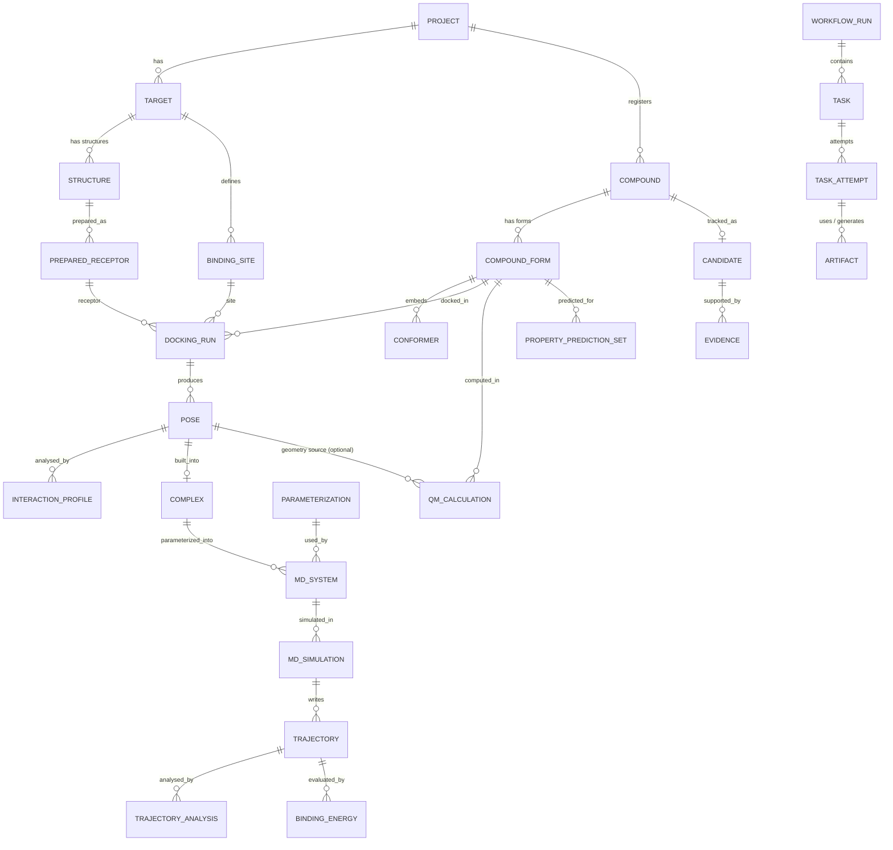

# Domain Model and Normalized Contracts

| | |
|---|---|
| **Status** | Phase 1 specification. Implemented in Phase 2 as `caddsuite.domain` + `caddsuite.contracts` |
| **Related** | ADR-0004 (Pydantic contracts and units), ADR-0005 (storage), `TARGET_ARCHITECTURE.md` §11 |

> **Learning note [concept: domain model].** A domain model names the things the science is about (compound, pose, trajectory, binding energy) *independently* of any engine or file format. Engines produce raw files; adapters translate them into these objects. That translation step is what lets you swap Vina for GNINA without the MD stage noticing.

---

## 1. Design rules

1. **Identity is never a filename** (fixes ARCH-02). Every entity has an immutable ULID primary key. User-facing records also get a human **accession** (below).
2. **Chemical identity is structural.** A compound is identified by the InChIKey of its *standardized parent*. Every calculation references a specific **CompoundForm** (e.g. the pH 7.4 protonated microstate) that is linked to that parent. This fixes SCI-10, where the same SMILES meant different species in different apps.
3. **Units are explicit in field names** (`temperature_K`, `timestep_fs`, `score_kcal_per_mol`, `energy_Eh`, `gap_eV`, `box_size_A`). Conversion constants live in one module, `caddsuite.domain.units` (CODATA 2018). This replaces the duplicated `627.5094740631` literals.
4. **Every normalized result** carries `schema_version`, the raw-artifact references it was derived from, the parameters actually used (after defaults), engine and adapter versions, and a provenance activity id.
5. **Semantics over convenience.** A docking score is typed as `DockingScore`, never as a free energy. MM/GBSA carries its entropy treatment. ADMET values carry their `kind` (descriptor / rule / ML prediction).

## 2. Accessions (human-readable identity)

Accessions follow the convention requested in the brief. They are unique per project, never reused, and are *labels*: relationships are always stored as foreign keys.

| Entity | Pattern | Example |
|---|---|---|
| Compound | `CMP{nnnn}` | `CMP0001` |
| Target | `TGT{nnn}` | `TGT001` |
| Docking run | `{CMP}_DOCK_{nnn}` | `CMP0001_DOCK_001` |
| Pose | `{CMP}_POSE_{nnn}` | `CMP0001_POSE_003` |
| MD simulation | `{CMP}_MD_{nnn}` | `CMP0001_MD_001` |
| Binding energy | `{CMP}_MMPBSA_{nnn}` (method stored separately) | `CMP0001_MMPBSA_001` |
| QM calculation | `{CMP}_QM_{nnn}` | `CMP0001_QM_001` |
| ADMET | `{CMP}_ADMET_{nnn}` | `CMP0001_ADMET_001` |
| Workflow run | `RUN-{yyyymmdd}-{nnn}` | `RUN-20260923-001` |

## 3. Entity map



## 4. Core entities (field-level specification)

Types are written Pydantic-style. `Ref[X]` means a foreign key to X. `ArtifactRef` is `{artifact_id, role}`.

### 4.1 Registry

```python
class Compound:            # CMP0001
    id: ULID; accession: str; project: Ref[Project]; name: str
    input_record: InputRecord            # original text/row/file, source (csv|sdf|pubchem|chembl|manual)
    parent: ChemicalIdentity             # standardized parent
    standardization: StandardizationRecord
    tags: list[str]

class ChemicalIdentity:
    canonical_smiles: str                # toolkit + version recorded in StandardizationRecord
    inchi: str; inchikey: str
    formula: str; formal_charge: int; heavy_atom_count: int

class StandardizationRecord:
    policy: str                          # e.g. "metal_disconnect>largest_fragment>uncharge" (legacy docking)
    steps: list[StandardizationStep]     # what each step changed (e.g. "removed [Na+]")
    toolkit: SoftwareRef                 # rdkit 2025.03.6

class CompoundForm:        # the species a calculation actually uses
    id: ULID; compound: Ref[Compound]
    kind: Literal["parent_neutral", "protonated_microstate", "tautomer", "user_supplied"]
    smiles: str; formal_charge: int; ph: float | None
    method: SoftwareRef | None           # e.g. dimorphite_dl 2.x, pH window, precision
    population_rank: int | None          # 1 = dominant, when enumerated
    decision: Ref[Decision] | None       # if a human chose it

class Conformer:
    id: ULID; form: Ref[CompoundForm]
    generator: str                       # "ETKDGv3"; seed: int; n_generated: int; selected_by: str
    optimizer: str | None                # "MMFF94" | "UFF"; converged: bool; energy_kcal_per_mol: float | None
    structure: ArtifactRef               # SDF with explicit H
```

### 4.2 Targets and structures

```python
class Structure:
    id: ULID; target: Ref[Target]
    source: Literal["rcsb", "alphafold", "local", "charmm_gui"]; source_id: str | None   # "5NIU"
    experimental_method: str | None; resolution_A: float | None
    model_index: int; altloc_policy: str                 # "first_model", "altloc A"
    entity_sequences: dict[str, str]                     # SEQRES/entity_poly: needed for gap detection (SCI-11)
    raw: ArtifactRef

class PreparedReceptor:
    id: ULID; structure: Ref[Structure]
    protocol: SoftwareRef                                # pdbfixer 1.12.0 + params
    ph: float; protonation_method: str
    removed: list[ComponentRecord]; kept: list[ComponentRecord]   # waters/ions/cofactors/metals, by policy
    missing_residues: list[GapRecord]                    # detected; modelled: bool
    artifacts: dict[str, ArtifactRef]                    # {"pdb": …, "pdbqt": …}

class BindingSite:
    id: ULID; target: Ref[Target]
    method: Literal["reference_ligand", "residue_selection", "coordinates", "blind_whole_protein", "pocket_detection"]
    reference: LigandReference | None                   # resname, chain, resseq, copies_found
    center_A: tuple[float, float, float]; size_A: tuple[float, float, float]
    padding_A: float | None; min_size_A: float | None
    volume_A3: float                                     # validators use it (SCI-05)
```

### 4.3 Docking

```python
class DockingRun:          # CMP0001_DOCK_001
    id: ULID; accession: str
    form: Ref[CompoundForm]; conformer: Ref[Conformer]
    receptor: Ref[PreparedReceptor]; site: Ref[BindingSite]
    engine: SoftwareRef; adapter: SoftwareRef
    params: dict                                          # normalized: exhaustiveness, num_modes, energy_range, seed, scoring
    poses: list[Ref[Pose]]; status: TaskState

class Pose:                # CMP0001_POSE_003
    id: ULID; accession: str; run: Ref[DockingRun]; rank: int
    score: DockingScore
    rmsd_to_best_lb_A: float | None; rmsd_to_best_ub_A: float | None
    cluster: ClusterMembership | None                     # real pairwise clustering (SCI-14)
    structure: ArtifactRef                                # NORMALIZED SDF: bond orders + explicit H
    raw: ArtifactRef                                      # engine-native (e.g. PDBQT model k)
    fidelity_max_dev_A: float                             # template-transfer check (build_complex.py)

class DockingScore:
    value: float; unit: Literal["kcal/mol"]
    scoring_function: str                                 # "vina" | "ad4" | "gnina_cnn_affinity"
    kind: Literal["docking_score"] = "docking_score"      # explicitly NOT a free energy
    ligand_efficiency: float | None                       # convention: -score / heavy_atoms (documented)
```

### 4.4 Complex, parameterization, MD

```python
class Complex:
    id: ULID; receptor: Ref[PreparedReceptor]; pose: Ref[Pose]
    builder: SoftwareRef; structure: ArtifactRef
    checks: list[Ref[ValidationIssue]]                    # clashes, bond orders, H completeness

class Parameterization:
    id: ULID
    ff_family: Literal["charmm", "amber", "openff"]
    protein_ff: str                                       # "CHARMM36m" | "ff14SB" | "ff19SB"
    ligand_method: str                                    # "CGenFF (via CHARMM-GUI)" | "GAFF2" | "OpenFF Sage 2.x"
    ligand_charge_model: str                              # "CGenFF" | "AM1-BCC" | "RESP(HF/6-31G*)"
    water_model: str; ion_parameters: str
    tool: SoftwareRef                                     # charmm-gui (server version, if known) | ambertools 23.6
    quality: dict                                         # e.g. CGenFF penalty scores, GAFF2 missing params
    artifacts: dict[str, ArtifactRef]

class MDSystem:
    id: ULID; complex: Ref[Complex] | None; parameterization: Ref[Parameterization]
    builder: SoftwareRef                                  # charmm_gui_import | amber_tleap
    box: BoxSpec; n_atoms: int; net_charge: float
    composition: dict[str, int]                           # protein residues, ligand atoms, waters, ions by type
    ionic_strength_M: float | None
    selections: dict[str, AtomSelection]                  # receptor, ligand (indices + count + verified)
    engine_inputs: dict[str, dict[str, ArtifactRef]]      # {"gromacs": {"top":…, "gro":…, "ndx":…}, "openmm": {…}}

class MDProtocol:          # normalized from engine inputs (e.g. .mdp) or generated
    stages: list[MDStage]  # minimization | nvt | npt | production

class MDStage:
    kind: Literal["minimization", "nvt", "npt", "production"]
    integrator: str; timestep_fs: float | None; n_steps: int | None; length_ns: float | None
    temperature_K: float | None; thermostat: str | None
    pressure_bar: float | None; barostat: str | None
    constraints: str | None; hmr: bool
    nonbonded: dict                                       # cutoffs, modifier (force-switch), PME
    restraints: str | None

class MDSimulation:        # CMP0001_MD_001
    id: ULID; accession: str; system: Ref[MDSystem]; protocol: MDProtocol
    engine: SoftwareRef; adapter: SoftwareRef
    seeds: dict[str, int]                                 # thermostat/velocity seeds actually used
    segments: list[SegmentRecord]                         # index, length_ns (verified = n_steps*dt, SCI-18), status
    total_ns: float; performance_ns_per_day: float | None

class Trajectory:
    id: ULID; simulation: Ref[MDSimulation]
    files: list[ArtifactRef]; topology: ArtifactRef
    n_frames: int; frame_interval_ps: float; time_range_ns: tuple[float, float]
    processing: list[str]                                 # ["concatenated", "pbc:whole", "pbc:nojump", "fit:backbone"]
```

### 4.5 Analyses

```python
class TrajectoryAnalysis:
    id: ULID; trajectory: Ref[Trajectory]; analyzer: SoftwareRef   # mdanalysis x.y
    metrics: list[MetricSeries]

class MetricSeries:
    name: str                              # "rmsd_ligand_pose"
    definition: dict                       # {"fit_selection": "protein and backbone", "target_selection": "resname LIG and not type H", "refit": false}
    unit: str; series: ArtifactRef         # CSV (time_ns, value)
    summary: dict                          # mean, sd, min, max over analysis window
    window_ns: tuple[float, float]         # equilibration exclusion made explicit

class BindingEnergyResult:  # CMP0001_MMPBSA_001
    id: ULID; accession: str; trajectory: Ref[Trajectory]
    method: Literal["MM/GBSA", "MM/PBSA"]; model: dict        # {"igb": 5, "radii": "mbondi2"} or PB settings
    tool: SoftwareRef                                         # gmx_MMPBSA 1.6.3 (+ AmberTools 23.6)
    frames: FrameSelection                                    # start, end, stride, n_used, window_ns
    temperature_K: float                                      # validated vs MD thermostat (SCI-07)
    salt_concentration_M: float
    entropy: Literal["none", "interaction_entropy", "c2", "nmode", "qh"]
    components_kcal_per_mol: dict[str, float]                 # vdw, eel, egb|epb, esurf|enpolar, ggas, gsolv, total
    statistics: EnergyStatistics                              # mean, sd, sem_naive, sem_block, n_effective, block_size
    label: str = "End-point effective binding energy estimate (not an experimental ΔG)"

class InteractionProfile:
    id: ULID; subject: Ref[Pose] | FrameRef
    method: SoftwareRef                                        # plip 2.x | geometric
    interactions: list[Interaction]                            # type, residue(chain,resname,resnum), ligand atoms, distance_A, angle_deg
```

### 4.6 Quantum chemistry (QCSchema-aligned)

```python
class QMCalculation:       # CMP0001_QM_001
    id: ULID; accession: str
    subject: Ref[CompoundForm]; geometry_source: Ref[Conformer] | Ref[Pose] | ArtifactRef
    engine: SoftwareRef; adapter: SoftwareRef
    model: QMModel                 # method ("b3lyp-d3bj"), basis ("6-31g*"), dispersion, reference (rks/uks)
    protocol: Literal["single_point", "optimization", "frequency", "opt_freq", "tddft"]
    solvation: SolvationSpec | None                            # {"model": "ddx_pcm", "solvent": "water"}
    charge: int; multiplicity: int
    requested_properties: list[str]; keywords: dict

class QMResult:
    calculation: Ref[QMCalculation]
    total_energy_Eh: float
    convergence: dict                                          # scf_converged, opt_converged, n_imaginary
    orbitals: dict | None                                      # homo_eV, lumo_eV, gap_eV
    dipole_D: float | None
    charges: dict[str, list[float]]                            # scheme → per-atom (atom order = geometry)
    vibrations: dict | None; thermochemistry: dict | None
    excited_states: list[dict]
    conceptual_dft: dict | None                                # Koopmans approximations, labelled
    volumetric: dict[str, ArtifactRef]                         # homo/lumo/esp/density cubes (if kept)
    figures: dict[str, ArtifactRef]
    pose_strain: PoseStrain | None                             # only after QM.POSE_IDENTITY passes (SCI-03)
    missing: list[str]                                         # requested but unavailable, never silent
```

### 4.7 ADMET / properties

```python
class PropertyPredictionSet:  # CMP0001_ADMET_001
    id: ULID; accession: str; form: Ref[CompoundForm]          # neutral parent by default (SCI-15)
    predictor: SoftwareRef
    predictions: list[PropertyPrediction]

class PropertyPrediction:
    endpoint: str                          # "logP", "tpsa", "lipinski_violations", "pains_alerts", "herg_inhibition"
    kind: Literal["calculated_descriptor", "rule", "structural_alert", "ml_prediction"]
    value: float | int | bool | str | list[str]; unit: str | None
    model: str | None; model_version: str | None; training_data: str | None
    uncertainty: float | None
    applicability_domain: dict | None      # {"in_domain": bool | None, "method": …, "score": …}
    definition: str                        # e.g. "Ghose: total atom count 20–70" (SCI-15 exactness)
```

### 4.8 Candidates, evidence, ranking

```python
class Candidate:
    id: ULID; compound: Ref[Compound]; project: Ref[Project]
    status: Literal["active", "excluded", "flagged"]; reasons: list[Ref[Evidence]]

class Evidence:
    id: ULID; candidate: Ref[Candidate]
    criterion: str                         # "docking.best_score", "mmgbsa.total", "admet.pains_count"
    value: float | int | bool | str; unit: str | None
    direction: Literal["lower_better", "higher_better", "boolean", "informational"]
    uncertainty: float | None
    source_result: Ref[...]                # the normalized result it came from
    kind: Literal["computational_prediction"] = "computational_prediction"

class RankingScheme:
    criteria: list[RankingCriterion]       # source, direction, normalization, weight, missing_policy
    aggregation: Literal["weighted_sum", "pareto", "lexicographic"]

class Ranking:
    scheme: RankingScheme; results: list[RankedCandidate]      # score + per-criterion contributions
    statement: str = "Prioritized according to the configured computational criteria; not experimental evidence."
```

### 4.9 Execution, provenance, validation

```python
class WorkflowRun:  id; accession; workflow_hash; resolved_config_hash; status; started_at; finished_at
class Task:         id; run; stage_id; subject_ref; cache_key; state: TaskState; attempts
class TaskAttempt:  id; task; n; executor; host: HostInfo; steps: list[StepRecord]; resources; exit_status;
                    started_at; ended_at; stdout: ArtifactRef; stderr: ArtifactRef; error: ErrorRecord | None
class StepRecord:   argv: list[str]; cwd; env_subset: dict; pid; process_start_time; exit_code
class Artifact:     id; sha256; size; media_type; kind; created_at; producer: Ref[TaskAttempt] | None; original_name
class Activity:     id; kind; attempt: Ref[TaskAttempt]; used: list[EntityRole]; generated: list[EntityRole];
                    agents: list[SoftwareRef]; platform: PlatformRef(version, git_commit, dirty)
class SoftwareRef:  name; version; kind: Literal["engine", "adapter", "library", "platform", "service"];
                    environment: Ref[SoftwareEnvironment] | None; license_class
class SoftwareEnvironment: id; kind (conda|container|system); name; prefix; lock: ArtifactRef; key_packages: dict
class HostInfo:     os; kernel; cpu_model; logical_cpus; memory_gb; gpus: list[GPUInfo]
class ValidationIssue: code; severity; subject; message; evidence; remediation; rule_version
class Decision:     id; issue: Ref[ValidationIssue]; question; options; chosen; decided_by; decided_at; scope
```

## 5. Contract versioning

- Every top-level payload has `schema_version: "<contract>/<major>.<minor>"`, e.g. `"docking_run/1.0"`.
- **Minor** = additive optional fields. **Major** = breaking change, which ships an *upcaster* that reads old payloads. This fixes the drift in which older `result.json` files lacked `solvent`.
- JSON Schemas are exported to `docs/schemas/` and are the source for the generated TypeScript types used by the UI.

## 6. Example normalized payload (docking, abbreviated)

```json
{
  "schema_version": "docking_run/1.0",
  "accession": "CMP0034_DOCK_001",
  "form": {"id": "01J8…", "smiles": "COc1ccc(CCNC(=O)C(=O)Nc2cccc(C)c2)cc1NCC(=O)O",
           "kind": "parent_neutral", "formal_charge": 0},
  "receptor": {"id": "01J8…", "source_id": "5NIU", "protocol": "pdbfixer 1.12.0, pH 7.4"},
  "site": {"method": "reference_ligand", "reference": {"resname": "8YZ", "chain": "A", "copies_found": 2},
           "center_A": [4.701, 12.376, 188.797], "size_A": [28.3, 22.0, 22.0], "volume_A3": 13697.2},
  "engine": {"name": "AutoDock Vina", "version": "1.2.7"},
  "adapter": {"name": "caddsuite.vina", "version": "0.1.0"},
  "params": {"exhaustiveness": 16, "num_modes": 9, "energy_range": 3.0, "seed": 42, "scoring": "vina", "cpu": 4},
  "poses": [{"accession": "CMP0034_POSE_001", "rank": 1,
             "score": {"value": -10.251, "unit": "kcal/mol", "scoring_function": "vina",
                       "kind": "docking_score", "ligand_efficiency": 0.3661},
             "structure": {"artifact_id": "01J8…", "role": "pose.sdf.normalized"},
             "fidelity_max_dev_A": 0.0}],
  "validation": [],
  "provenance": {"activity_id": "01J8…"}
}
```

> The values above come from your real `test_docking` project (RC34 vs 5NIU). The legacy run did not record `cpu`; the migrated adapter always will.
