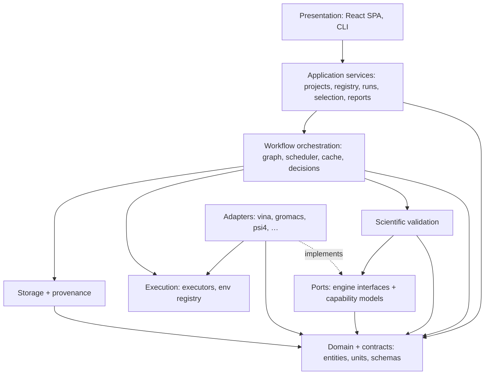
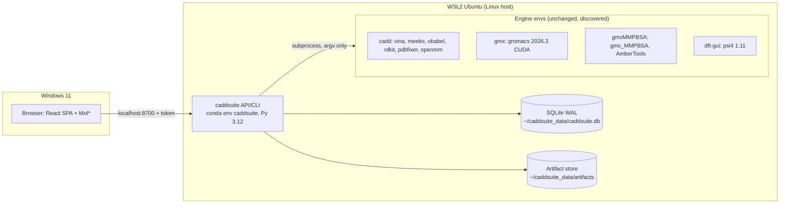
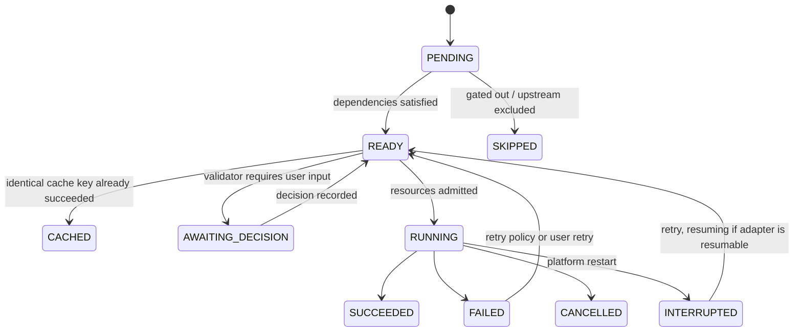
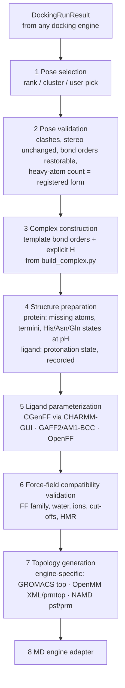

# Target Architecture — CADD Suite (working name)

| | |
|---|---|
| **Status** | Phase 1 draft v0.1, derived from `docs/ARCHITECTURE_AUDIT.md` |
| **Date** | 2026-09-23 |
| **Decisions** | Each major decision is recorded in `docs/architecture/ADR/` |
| **Companion docs** | `DOMAIN_MODEL.md` (entities and contracts), `MIGRATION_PLAN.md` (legacy → target mapping and phases) |

> **How to read this document (learning note).** Each section states *what* the component does, *why* it exists (usually traced to an audit finding ID such as SCI-02 or ARCH-03), and *what alternatives were considered*. Interview-relevant concepts are marked **[concept]**.

---

## 1. Goals, non-goals, quality attributes

**Goals**
1. One platform that runs any *scientifically valid* chain of: standardization → ADMET → docking → pose analysis → complex preparation → MD → trajectory analysis → MM/PB(GB)SA → QM → evidence integration → report. The user configures, reorders, enables and disables stages.
2. Engines are **replaceable plugins**. Adding GNINA, OpenMM, NAMD or ORCA must not require changes to the core.
3. Every number is **traceable**: inputs, parameters, software versions, environment, seeds, commands and logs.
4. Scientific incompatibilities are **surfaced, never hidden**. When a decision cannot be safely automated, the platform **asks**.
5. Existing validated science is **preserved and regression-tested** against your own historical results.

**Non-goals (for now)**
- Multi-user server, authentication beyond localhost tokens, or cloud deployment. The design keeps the door open (ADR-0005, ADR-0007) without building any of it.
- Re-implementing engines. The platform orchestrates engines; it does not replace them.
- Hiding the CHARMM-GUI step before a validated automated alternative exists (ADR-0011).

**Quality attributes, in priority order:** scientific correctness › reproducibility › extensibility › fault tolerance › usability › performance.

---

## 2. Constraints discovered by the audit

| Constraint | Source | Architectural response |
|---|---|---|
| Engines live in **4 conda envs with incompatible Pythons** (3.9/3.10/3.11/3.12) | Audit §4.1 | The core never imports engine libraries. Engine-side code runs as **worker processes inside the engine's env** (§6) |
| Psi4 keeps global state; the in-process GUI leaked options between jobs | SCI-02, ARCH-04 | **One fresh process per QM task** |
| Engines run on Linux (WSL2); the user is on Windows; trajectory I/O over `/mnt/c` is slow | Audit §1, MD README | Backend and data on the **Linux host** (WSL-native disk). UI in the Windows browser over localhost (ADR-0007) |
| One 16-thread / 7 GB / 1-GPU workstation, but the goal includes HPC later | Audit §1 | **Executor abstraction** plus an explicit resource model (§7) |
| Results were cached by file existence | ARCH-03 | **Content-hash task keys** (§8.4) |
| No provenance, unversioned schemas | ARCH-07 | **Provenance graph plus versioned contracts** (§11, `DOMAIN_MODEL.md`) |
| MD systems are CHARMM36m/CGenFF built manually in CHARMM-GUI | Audit §2.3 | A `SystemBuilder` port with a **CHARMM-GUI import adapter** plus an automated builder (ADR-0011) |

---

## 3. Layered view and dependency rules



**Dependency rules** (enforced by an `import-linter` contract test, i.e. an *architectural fitness function* **[concept]**):

1. `domain`/`contracts` import nothing from the platform. They are pure data plus validation.
2. `workflow`, `validation`, `application` depend on `ports` and never on `adapters`. Adapters are found at runtime through the plugin registry (§5.5).
3. `adapters` may import `ports`, `domain`, `chem`, `structure`, `analysis` and the `execution` *types*. They never import `workflow` or `storage`.
4. Nothing imports `api` or `cli`. The presentation layer sits on top.
5. `caddsuite_worker` (engine side) imports **only the Python standard library** plus the engine it wraps, because it must run inside foreign conda envs (§6).

**Why layers? [concept: hexagonal architecture / ports & adapters].** The scientific core expresses *what* must happen (dock this ligand into this site with these parameters). Adapters translate that into *how* one specific engine does it. The dependency arrow always points inward, so engines, UI and storage can change without touching the science. This is the direct cure for "Docking = Vina, MD = GROMACS" hard-coding (Audit §5).

---

## 4. Runtime and deployment view



- **Source code** lives on WSL-native storage at `~/CAAD_Suite_End_to_End` (moved there from OneDrive on 2026-09-23, decision D1). **Data never lives on OneDrive or `/mnt/c`.** This preserves a lesson the existing apps learned the hard way: GROMACS I/O over the Windows bridge is dramatically slower.
- The existing engine envs are **reused as-is** and discovered through `site.yaml` (§12). The platform adds exactly one new env, `caddsuite`, for its own core.
- Later: `SSHExecutor`/`SlurmExecutor` run the same adapter plans on remote hosts (ADR-0007).

---

## 5. Ports, adapters and plugins

### 5.1 Why adapters "plan" and executors "run"

The usual example interface (`execute()`, `monitor()`, `cancel()` inside every adapter) was **deliberately not copied**. In the legacy scripts, command construction, execution, locking, logging and progress parsing are fused together (ARCH-05), which made them untestable. The target splits responsibilities:

| Responsibility | Owner | Why |
|---|---|---|
| Is the engine installed? Which version? | `adapter.discover()` | Engine-specific |
| What can it do? | `adapter.capabilities()` | Engine-specific |
| Is this request valid and compatible? | `adapter.validate()` + validation rules | Engine- and science-specific |
| Which files and commands are needed? | `adapter.plan()` — **pure, no side effects** | Golden-testable without the engine |
| Run, monitor, cancel, retry, reattach after a crash | **Executor** + scheduler | Identical for all engines; swappable for SSH/SLURM |
| How far along is it? | `adapter.progress()` (parses logs) | Engine-specific (keeps the GROMACS/gmx_MMPBSA parsing from `md_ctl.sh` and `mmpbsa_ctl.sh`) |
| What does the output mean? | `adapter.normalize()` | Engine-specific parsing → engine-independent contract |

**[concept: separation of policy and mechanism]** Adapters are *policy* (what to run); executors are *mechanism* (how processes are managed). The golden-test consequence is significant: `plan()` for Vina can be asserted byte-for-byte against the command line that `dock_run.sh` produced, on any laptop, without Vina installed.

### 5.2 Base adapter contract (Python, typed)

```python
class EngineAdapter(Protocol):
    info: AdapterInfo            # id="vina", family=Family.DOCKING, adapter_version="0.1.0",
                                 # engine_name="AutoDock Vina", license_class=LicenseClass.OPEN_SOURCE

    def discover(self, site: SiteConfig) -> Installation: ...
        # locate binaries/env, run version probe; returns available, version, paths, diagnostics

    def capabilities(self, inst: Installation) -> CapabilitySet: ...   # family-specific typed model

    def validate(self, request: TaskRequest, inst: Installation,
                 ctx: ValidationContext) -> list[ValidationIssue]: ...

    def plan(self, request: TaskRequest, inst: Installation) -> ExecutionPlan: ...
        # PURE: returns files to materialize, ordered steps (CommandSpec | WorkerCall),
        # resource request, expected outputs, resumability, seeds actually used

    def progress(self, plan: ExecutionPlan, workdir: Path) -> Progress | None: ...

    def normalize(self, plan: ExecutionPlan, outcome: ExecutionOutcome) -> AdapterResult: ...
        # AdapterResult = normalized contract + raw artifact roles + warnings + error mapping
```

Family ports narrow the types, e.g. `DockingEngine.plan(DockingRequest) -> ExecutionPlan` and `DockingEngine.normalize(...) -> DockingRunResult`.

| Port | Request → normalized result | Initial adapters (migrated) | Proof-of-extensibility adapter |
|---|---|---|---|
| `StructureSource` | `StructureRequest` → `Structure` | RCSB (from `fetch_receptor.py`), local file | AlphaFold DB |
| `DockingEngine` | `DockingRequest` → `DockingRunResult` | **Vina** (dockingsuite) | **AutoDock4** (autopilot, pending Q1) or **GNINA** |
| `SystemBuilder` | `SystemBuildRequest` → `MDSystem` | **CHARMM-GUI bundle import** | **AmberTools tleap + GAFF2/AM1-BCC** (ADR-0011) |
| `MDEngine` | `MDRequest` → `MDSimulationResult` | **GROMACS** (mdsuite) | **OpenMM**, then NAMD |
| `TrajectoryAnalyzer` | `AnalysisRequest` → `TrajectoryAnalysisResult` | MDAnalysis-based (engine-independent) | — |
| `BindingEnergyEngine` | `BindingEnergyRequest` → `BindingEnergyResult` | **gmx_MMPBSA** | MMPBSA.py (AmberTools) |
| `QMEngine` | `QMRequest` → `QMResult` | **Psi4** (dft-gui-suite) | **ORCA** (user-installed) |
| `PropertyPredictor` (ADMET) | `PropertyRequest` → `PropertyPredictionSet` | RDKit rules + alerts (autopilot, fixed) | ADMET-AI (ML) |
| `InteractionProfiler` | `InteractionRequest` → `InteractionProfile` | PLIP (autopilot) + geometric fallback | ProLIF |
| `ReportRenderer` | `ReportModel` → artifacts | HTML, PDF, JSON, CSV | — |

### 5.3 Capability models (typed, per family)

Capabilities are **typed Pydantic models**, not free-form dicts, so the workflow builder can reason about them and the UI shows only valid options. Examples:

```yaml
# DockingCapabilities (Vina 1.2.7)
search_space: [box]                # vs [box, autobox_ligand] for GNINA
flexible_sidechains: true          # Vina supports --flex (not used by legacy)
scoring_functions: [vina, vinardo, ad4]
rescoring: false                   # GNINA: cnn
input_formats: {receptor: [pdbqt], ligand: [pdbqt]}
output_formats: [pdbqt]
deterministic_with_seed: true
resources: {cpu: true, gpu: false, mpi: false}

# QMCapabilities (Psi4 1.11)
scope: molecular                   # Quantum ESPRESSO: periodic
drivers: [energy, gradient, optimization, frequency]
methods: {dft: true, hf: true, mp2: true, tddft: true}
solvation: [ddx_pcm]
properties: [homo_lumo, dipole, mulliken, lowdin, mbis, resp, esp_cube, orbital_cube, density_cube, fukui_fd]
dispersion: [d3bj]
```

### 5.4 Engine discovery

`caddsuite doctor` (successor of `dockapp doctor` / `mdsuite doctor`) runs `discover()` for every registered adapter. It **reports** and **never auto-installs** (fixes SEC-08):

```
Engine            Family      Status        Version        Location
AutoDock Vina     docking     ✓ available   1.2.7          env:cadd (~/miniconda3/envs/cadd/bin/vina)
AutoDock4         docking     ✗ missing     —              install: conda install -c bioconda autodock
GROMACS           md          ✓ available   2026.3 (CUDA)  env:gmx (bin.AVX2_256/gmx)
gmx_MMPBSA        binding     ✓ available   1.6.3          env:gmxMMPBSA
Psi4              qm          ✓ available   1.11           env:dft-gui
ORCA              qm          ✗ not found   —              user-installed, licensed (see docs)
```

Resolution is explicit. The configured env prefix or binary path wins. **There is no `find $HOME`, no Downloads/Desktop globbing, and no bundled binaries preferred over installed ones** (fixes ARCH-08, SEC-07).

### 5.5 Plugin mechanism

Adapters register through **Python entry points** (the standard packaging mechanism **[concept]**):

```toml
[project.entry-points."caddsuite.adapters"]
vina       = "caddsuite.adapters.docking.vina:VinaAdapter"
gromacs    = "caddsuite.adapters.md.gromacs:GromacsAdapter"
psi4       = "caddsuite.adapters.qm.psi4:Psi4Adapter"
```

A third-party package declaring the same group appears automatically: *install plugin → registered → discovered → capabilities → usable in workflows*. Built-in adapters use the same mechanism, so there is no privileged path. The adapter SDK (Phase 17) documents the contract and ships a **conformance test suite** that every adapter must pass (`caddsuite.testing.adapter_conformance`).

---

## 6. Engine-side workers (process isolation)

**Problem.** Psi4 needs Python 3.10 (`dft-gui`), gmx_MMPBSA needs 3.9, and Meeko/RDKit run in 3.11. The core cannot import them together, and the in-process Psi4 GUI leaked global state (SCI-02).

**Design.** When an engine exposes a Python API rather than a CLI (Psi4; later OpenMM, MDAnalysis-heavy steps, RDKit prep inside `cadd`), the adapter plans a **`WorkerCall`**:

```
<engine-env>/bin/python -m caddsuite_worker.run --task task.json --result result.json --events events.jsonl
```

- `caddsuite_worker` is **stdlib-only** and is placed on `PYTHONPATH` from the platform source, so nothing is installed into your existing envs.
- `task.json` contains `{protocol:"caddsuite.worker/1", task_id, operation, params, inputs:{role: path}, seed}`.
- `result.json` contains `{status, outputs:{role: path}, data:{…engine-native values…}, warnings, error:{code, message, detail}, versions:{psi4:"1.11", …}}`.
- `events.jsonl` holds progress events (streamed to the UI).
- The **core-side adapter** validates `result.json` and converts `data` into the Pydantic contract. Pydantic never needs to exist inside engine envs.
- One process per task means a clean Psi4 state every time (SCI-02 is fixed by construction). A worker crash cannot take down the orchestrator.

**[concept: process isolation]** This is the same idea the autopilot GUI got right with `QProcess`, generalized to every engine.

---

## 7. Execution layer

```python
class Executor(Protocol):
    def submit(self, step: StepSpec, resources: ResourceRequest, workdir: Path) -> JobHandle: ...
    def poll(self, handle: JobHandle) -> JobStatus: ...
    def cancel(self, handle: JobHandle, grace_seconds: float = 10) -> None: ...
    def reattach(self, record: JobRecord) -> JobHandle | None: ...   # after app restart
```

**`LocalExecutor` (Phase 3):**
- `subprocess.Popen(argv, cwd=workdir, env=explicit_env, start_new_session=True)`. **Argument lists only, never `shell=True`** (fixes SEC-02). Every argument is validated (paths resolved inside the task workdir or artifact store; numeric parameters typed).
- stdout/stderr stream to files that become artifacts. Structured events go to the task log.
- Cancellation sends SIGTERM to the whole **process group**, then SIGKILL after a grace period. This kills `mpirun` → `gmx_MMPBSA` → `sander` trees, which `pkill -P` (direct children only) did not.
- **Crash recovery:** the job record stores PID + process start time (`/proc/<pid>/stat`) so a restarted platform can safely reattach or mark `INTERRUPTED`. This handles PID reuse; plain PID files cannot.
- Temp-then-rename for outputs whose presence implies completeness. This generalizes the careful `.tmp.xtc` lesson.

**Resource model.** `site.yaml` declares capacity (auto-detected, user-overridable):

```yaml
resources:
  cpus: 16
  memory_gb: 7          # WSL-visible RAM
  gpus: [{index: 0, name: "RTX 5050 Laptop", memory_gb: 8}]
  max_concurrent_tasks: 8
```

Each planned step declares a `ResourceRequest(cpus, gpus, memory_gb, exclusive_gpu, walltime)`. The scheduler admits work only within capacity. This replaces the two uncoordinated FIFO queues (ARCH-09): docking fans out as many 1–4-CPU Vina jobs (the autopilot's better throughput pattern), while GPU MD holds the GPU slot exclusively. `CUDA_VISIBLE_DEVICES` and thread counts (`-ntomp`, `--cpu`, `psi4 -n`, `mpirun -np`) come from the admitted allocation, never from `nproc`.

**Later (Phase 26+ in TODO):** `SSHExecutor` (rsync workdir, run remotely) and `SlurmExecutor` (render sbatch, poll `squeue`/`sacct`). They use the same `StepSpec`, so adapters stay untouched.

---

## 8. Workflow orchestration

### 8.1 Model

```yaml
# workflows/dock_md_mmgbsa.yaml (illustrative)
schema: caddsuite.workflow/1
name: dock → MD → MM-GBSA
inputs: {compounds: registry, target: TGT-0001}
stages:
  - id: standardize
    kind: chem.standardize
    for_each: compound
    params: {policy: parent_neutral_then_protonate, ph: 7.4, protonation_tool: dimorphite_dl}
  - id: admet
    kind: admet
    engine: rdkit_rules
    for_each: compound
    needs: [standardize]
  - id: gate_admet
    kind: gate
    for_each: compound
    rule: "admet.lipinski_violations <= 1 and admet.pains_count == 0"
    on_fail: exclude            # or: flag
  - id: dock
    kind: docking
    engine: vina                # swap to gnina/autodock4 without touching other stages
    for_each: compound
    needs: [gate_admet]
    params: {site: {method: reference_ligand, ligand: auto, padding_A: 5.0, min_size_A: 22.0},
             exhaustiveness: 16, num_modes: 9, seed: 42}
  - id: select
    kind: selection
    needs: [dock]
    rule: {rank_by: dock.best_score, direction: min, top_n: 5}
  - id: build_system
    kind: system_build
    engine: charmm_gui_import   # or amber_tleap
    for_each: selected_pose
    needs: [select]
  - id: md
    kind: md
    engine: gromacs
    for_each: selected_pose
    needs: [build_system]
    params: {production_ns: 100, segment_ns: 1, temperature_K: from_system}
  - id: traj
    kind: trajectory_analysis
    needs: [md]
    params: {metrics: [rmsd_backbone, rmsd_ligand_pose, rmsd_ligand_internal, rmsf, rg, sasa, hbonds, contacts],
             equilibration_window_ns: 20}
  - id: mmgbsa
    kind: binding_energy
    engine: gmx_mmpbsa
    needs: [md]
    params: {method: gb, igb: 5, salt_M: 0.150, window_ns: [0, 100], stride_frames: 1, entropy: none}
  - id: report
    kind: report
    needs: [admet, dock, traj, mmgbsa]
```

The **compiler** validates the definition against the registered capabilities: stage kinds exist, engines support the requested features, and data-type contracts match along each `needs` edge. It then produces a **task graph** keyed by `(stage, compound, pose)`. Any subset or order that type-checks is allowed: *ADMET → docking → report*, *docking → QM*, and so on.

### 8.2 Task states



All state lives in SQLite. The UI and CLI **read** state and never reimplement it (fixes ARCH-10).

### 8.3 Gates and selection rules

Gates use a **restricted expression language**. It is parsed with Python's `ast` and only whitelisted nodes are accepted: comparisons, `and/or/not`, numeric and string literals, dotted field access on *declared* result fields, and the functions `abs, min, max, len, exists`. There is no `eval`, no calls to arbitrary functions, and no dunder access. Thresholds are **always user-configured**. The platform ships *example* rules labelled as examples, never as defaults presented as scientific truth. Every gate evaluation is stored as evidence ("excluded because `admet.pains_count == 1`").

### 8.4 Caching, resume, retry

**[concept: content-addressed memoization]** Every task gets a cache key:

```
sha256( canonical_json({
  contract_version, adapter_id, adapter_version, engine_version,
  normalized_params,               # after defaults are applied
  input_artifact_hashes            # e.g. ligand form SDF, receptor PDBQT, box
}))
```

- **Resume** = rerun the graph. Tasks whose key already succeeded become `CACHED` and are linked in provenance. Changing a SMILES, box, seed or engine version changes the key, so stale results are never reused. This fixes ARCH-03, where `jobs.csv` and `ligand.sdf` were trusted merely because they existed.
- **Engine-level checkpoints:** adapters that declare `resumable` plan a resume variant. GROMACS uses `mdrun -cpi state.cpt` so an interrupted 1 ns segment continues instead of restarting. The legacy `stop` message promised this but `-cpi` was never passed (SCI-25).
- **Retry policy per stage:** `max_attempts`, backoff, and `retry_on` error codes (e.g. `EXEC.MPI_STALE_SESSION`, the real OpenMPI failure handled today by the 3-attempt loop in `mmpbsa_run.sh`).
- User actions: retry a failed task, re-run a stage (optionally invalidating downstream), re-run from a checkpoint, cancel a task, a candidate or a run.

### 8.5 Decisions ("ask, don't assume")

Validators can return `DECISION_REQUIRED` issues. The task pauses in `AWAITING_DECISION` with a structured question. For example:

> *"Receptor 8J3V has no co-crystallised ligand. Options: (a) blind docking with a whole-protein box of 116 × 53 × 39 Å (exhaustiveness should be raised to ≥ 64), (b) provide a site from a reference complex, (c) provide box coordinates."*

The answer, who gave it, and when are stored as provenance. Batch policies ("always choose (a) for this run") are allowed and also recorded.

---

## 9. Scientific validation framework

```python
class ValidationIssue(BaseModel):
    code: str                    # stable identifier, e.g. "MMGBSA.TEMPERATURE_MISMATCH"
    severity: Severity           # BLOCKER | DECISION_REQUIRED | WARNING | INFO
    subject: SubjectRef          # which compound/structure/task/parameter
    message: str                 # what is wrong
    evidence: dict               # values that triggered it
    remediation: list[str]       # what the user can do
    rule_version: str
```

Rules are registered per **stage kind** and per **edge** (e.g. `docking → system_build`) and run at compile time (static checks) and at run time (on actual artifacts). **Every audit finding becomes a rule, which is how fixed bugs stay fixed [concept: regression-proofing through invariants]:**

| Rule | From audit | Check |
|---|---|---|
| `MMGBSA.GROUP_MISMATCH` | SCI-01 | Ligand/receptor selections resolved from the system model; atom counts must match the system's ligand |
| `QM.STATE_ISOLATION` | SCI-02 | QM tasks must run in a fresh worker (enforced by plan) |
| `QM.POSE_IDENTITY` | SCI-03 | Same InChIKey, formula and formal charge before computing strain or RMSD; atom mapping by substructure |
| `MD.GROMPP_WARNINGS` | SCI-04 | No blanket `-maxwarn`; each warning classified (known-benign allow-list or surfaced) |
| `DOCK.BLIND_BOX` | SCI-05 | Whole-protein boxes → DECISION_REQUIRED; results carry `site.method`; no co-ranking across methods by default |
| `DOCK.BOX_TOO_SMALL` | SCI-16 | Ligand maximum extent + margin must fit the box |
| `ANALYSIS.RMSD_DEFINITION` | SCI-06 | Ligand RMSD outputs must declare fit group and RMSD group |
| `MMGBSA.TEMPERATURE_MISMATCH` | SCI-07 | Temperature equals the MD thermostat reference |
| `MMGBSA.CORRELATED_SAMPLES` | SCI-08 | Report block-averaged SEM and the effective sample size |
| `LIG.PROTONATION_RECORDED` | SCI-09 | Every 3D ligand form records method, pH, tool and version |
| `LIG.PARENT_CONSISTENCY` | SCI-10 | All stages of a candidate use the registered parent (InChIKey) or a declared form of it |
| `REC.SEQRES_GAPS` | SCI-11 | Missing internal residues detected from the sequence and reported (modelled or not, by policy) |
| `FF.FAMILY_CONSISTENCY` | Req. §14 | Exact component assignments must match a registered profile; unsupported/unknown combinations require a decision |
| `MD.SEGMENT_LENGTH` | SCI-18 | `nsteps × dt` checked against the declared segment length |

---

## 10. The docking → MD transition (explicit, validated)



**Normalized pose contract.** Every docking adapter must emit poses as **SDF with bond orders and explicit hydrogens**, rebuilt from the registered ligand form. For Vina this is the template transfer proven in `build_complex.py`. Docking is therefore decoupled from MD: any docking engine → normalized pose → any system builder.

**Compatibility is data, not an assumption:**

| Compatibility profile | Protein | Ligand | Water | Ions | Topology/preparation | State |
|---|---|---|---|---|---|---|
| Audited CHARMM-GUI import declaration | CHARMM36m | CGenFF | CHARMM TIP3P | CHARMM set | GROMACS bundle importer | Implemented; checks declarations/file consistency, not physical accuracy |
| AmberTools proposal | ff14SB | GAFF2 + AM1-BCC | Explicit Amber-compatible selection | Explicit Amber-compatible selection | tleap; ParmEd-to-GROMACS conversion gated on energy checks | Planned, not executable yet |
| OpenFF/Amber proposal | Profile-specific Amber protein + OpenFF ligand | Sage | Explicitly selected | Explicitly selected | Interchange conversion gated per output engine | Research candidate; not enabled |

An absent or unknown profile yields `DECISION_REQUIRED`. A declaration contradicting its selected profile is a blocker. A deliberate mixed-family parameterization may be valid only when a profile records the exact component combination and profile-specific evidence; a family label or topology parser success is not proof. See `docs/architecture/FORCE_FIELD_COMPATIBILITY.md`. MM/GBSA radii compatibility remains a separate Phase 9 validation task.

---

## 11. Storage and provenance

**Metadata** is stored in SQLite (WAL) through SQLAlchemy 2.0 with Alembic migrations. PostgreSQL is possible later with no model changes (ADR-0005). Main tables:
`projects, targets, compounds, compound_forms, structures, workflows, workflow_runs, tasks, task_attempts, artifacts, artifact_roles, results, evidence, validation_issues, decisions, activities, software_agents, environments, rankings, reports`.

Result payloads are stored as **versioned JSON** (`schema_version`), with hot scalars (e.g. `best_score`, `delta_g_kcal`) promoted to indexed columns for dashboards.

**Artifacts** go in a content-addressed store:
- Path: `~/caddsuite_data/artifacts/sha256/ab/cd/<hash>`.
- Files are immutable and read-only.
- Each artifact has a DB row with `id` (ULID), `sha256`, `size`, `media_type`, `kind` (e.g. `structure.pdb`, `trajectory.xtc`, `log.stdout`), `created_at`, `producer_task`, `original_name`.
- Human-browsable project views (`projects/<slug>/runs/<run>/<stage>/<compound>/…`) are symlinks. **Filenames are never identity** (fixes ARCH-02).
- Trajectories, cubes and topologies stay on disk and never go in the DB.

**Provenance** follows a W3C-PROV-inspired graph **[concept]**:
- *Entities*: artifacts and results.
- *Activities*: task attempts.
- *Agents*: engine + version, adapter + version, platform version + git commit + dirty flag, and the user for decisions.

Each attempt records:
- argv, working directory, selected environment variables, seeds;
- the env lock (`conda list --explicit` hash, stored once per env snapshot);
- host facts (OS, kernel, CPU model, cores, RAM, GPU model, driver, CUDA);
- timing, exit code, and stdout/stderr artifacts;
- `used`/`generated` edges.

The question "Exactly how was this ΔG generated?" becomes a graph walk: `BindingEnergyResult → gmx_MMPBSA attempt → trajectory artifact → GROMACS attempts → MDSystem → builder attempt → complex → pose → DockingRun → ligand form → standardization → registered compound`.

**Project export (reproducibility package)**, detailed in ADR-0012:

```
<project>.caddsuite/
  manifest.json           # every artifact: path, sha256, kind, producer
  project.yaml  workflow.yaml  resolved_config.yaml
  provenance/graph.json   provenance/activities/*.json
  results/*.json          reports/*
  environments/<env>.lock.txt (conda explicit)  site.yaml (sanitized)
  artifacts/…             # optionally without trajectories (--slim)
```

---

## 12. Configuration

Layered, validated with Pydantic. Everything is YAML read with `safe_load`; **nothing is ever `source`d or `eval`ed** (fixes ARCH-06, SEC-01):

1. Packaged defaults: `configs/defaults/{docking,md,qm,admet,analysis,resources}.yaml`, plus curated data lists (the HETATM exclusion list, solvent/ion names) moved out of code.
2. Site: `~/.config/caddsuite/site.yaml` (engine env prefixes and binaries, resource capacity, data root).
3. Project: `project.yaml` (target definitions, compound sources, pH policy).
4. Workflow: `workflow.yaml` (stages and parameters).
5. Run overrides (CLI/API).

The **resolved** configuration (after merging) is frozen, hashed and stored with each run. The QM file is named `qm.yaml` rather than `dft.yaml` because the layer covers DFT, HF and TD-DFT (the requirement "DFT must be a generic quantum chemistry stage").

---

## 13. Errors and logging

**Error record**, which answers the requirement's questions:

```python
class ErrorRecord(BaseModel):
    code: str             # WHAT: e.g. QM.SCF_NOT_CONVERGED, MD.SYSTEM_UNSTABLE, ENGINE.NOT_FOUND,
                          #       INPUT.INVALID_STRUCTURE, RESOURCE.GPU_UNAVAILABLE, RESOURCE.DISK_FULL,
                          #       EXEC.TIMEOUT, EXEC.MPI_STALE_SESSION, PARAM.FORCEFIELD_MISMATCH
    message: str          # human summary
    cause: str | None     # WHY (parsed from engine output where possible)
    stage_id: str; task_id: str          # AT WHICH STAGE
    inputs: list[ArtifactRef]            # WHAT INPUT caused it
    remediation: list[str]               # WHAT CAN THE USER DO
    retryable: bool                      # WAS IT RETRYABLE
    partial_outputs: list[ArtifactRef]   # WAS PARTIAL OUTPUT GENERATED
    engine_excerpt: str | None           # last relevant log lines
```

Adapters map engine failure signatures to codes, for example Psi4 "Could not converge SCF iterations" → `QM.SCF_NOT_CONVERGED` with remediation suggestions; GROMACS LINCS warnings or a blow-up → `MD.SYSTEM_UNSTABLE`. **Sub-step failures are never silently swallowed** (fixes ARCH-11). A QM task whose requested property failed is `SUCCEEDED_WITH_WARNINGS`, and the missing property is listed explicitly.

**Logging:** each task attempt produces a structured JSONL log (timestamp, level, event, task, stage, fields) plus raw stdout/stderr artifacts. The platform log uses the same JSONL format. The UI streams both.

---

## 14. Analysis, binding energy, QM, ADMET layers

- **Trajectory analysis** is engine-independent, built on MDAnalysis (reads GROMACS xtc/tpr, NAMD dcd/psf, OpenMM dcd/pdb, AMBER nc/prmtop). Metrics: backbone RMSD; **ligand pose RMSD** (fit on the receptor, no refit) *and* ligand internal RMSD, explicitly labelled (SCI-06); RMSF; Rg; SASA; H-bonds with donor/acceptor/angle criteria; contacts; interaction persistence; clustering. The legacy `gmx` pipeline remains as a **cross-validation reference**: Phase 8 must reproduce the 2M2D_LIG CSVs within stated tolerances before the switch.
  - Risk to verify: MDAnalysis support for GROMACS 2026 TPR files. Fallback: topology from `gmx editconf` PDB plus bonds from the system model.
- **Binding energy (MM/PB(GB)SA):** the method (GB model, PB), tool and version, frames used, sampling window, stride, energy components, entropy treatment, and statistics (mean, SD, SEM, **block-averaged SEM, effective N**) are all mandatory fields. Results are labelled *"MM/GBSA effective binding energy — an end-point estimate, not an experimental binding free energy"*.
- **QM** uses a request aligned with MolSSI **QCSchema** concepts (molecule, model{method, basis}, driver, keywords, requested properties). Composite protocols (opt+freq, Fukui by finite difference, RESP) are declared by adapters as capabilities. Cube-based visualization (FMO, MEP, Fukui) is **engine-independent**, because ORCA (`orca_plot`) and Gaussian (`cubegen`) also emit cubes.
- **ADMET:** every prediction records `kind ∈ {calculated_descriptor, rule, ml_prediction}`, model id and version, training-data reference when known, uncertainty, and an applicability-domain flag. The rule-based module from the autopilot is labelled as **drug-likeness rules and structural alerts**, not as "ADMET prediction" (SCI-15).

---

## 15. Evidence, prioritization, reporting

- **Evidence** records keep raw value, unit, direction (lower/higher is better), uncertainty, method and a provenance link.
- A **RankingScheme** is user-defined: criteria, normalization (rank / min-max / z-score / threshold), weights, missing-value policy, and aggregation (weighted sum, Pareto front, lexicographic). The output shows **per-criterion contributions** for every candidate. Wording is fixed by design: *"prioritized according to the configured computational criteria"*. It is never "best drug".
- **Reports** are built as a report model from the DB, then rendered to HTML (Jinja2), PDF, JSON and CSV. Methods text is **generated from provenance**, generalizing the DFT app's `_methods_paragraph` so methods cannot drift from what actually ran. Limitations are generated from validation issues plus method caveats. The reproducibility section lists versions, parameters and environment. A mandatory statement distinguishes **computational prediction** from **experimental validation**.

---

## 16. Presentation (Phase 13, deliberately last)

- **API:** FastAPI (Pydantic-native, OpenAPI → generated TypeScript client) with REST plus Server-Sent Events for live logs and progress. It binds to 127.0.0.1 and requires a **per-install token plus an Origin check** (fixes SEC-05). Uploads are written only through a validated artifact-ingest path (fixes SEC-04).
- **UI:** React + TypeScript (Vite) and **Mol\*** for proteins, poses, complexes, trajectories and cube volumes (orbitals, MEP). It includes a dashboard, a workflow builder (form-based first; node editor later), candidate views, logs, provenance and validation panels.
- **Electron:** optional desktop shell later. The browser already works against the WSL backend with no packaging (ADR-0009). **Streamlit is not used in the core.**
- **CLI (Typer)** is a first-class interface from Phase 3 on. Your current workflows are CLI-driven, and the CLI is what runs on HPC.

---

## 17. Testing strategy

| Level | What | Engine needed? |
|---|---|---|
| Unit | contracts, units, chem utilities, validators, expression language, cache keys | No |
| Adapter golden | `plan()` output vs golden JSON; `normalize()` on **recorded real outputs** (Vina PDBQT, DLG fixtures, `psi4.out`/`result.json`, `FINAL_RESULTS_MMGBSA.dat`, `.xvg`) | No |
| Conformance | every adapter passes the SDK conformance suite | No |
| Workflow | fake deterministic adapters: DAG, gates, fan-out, caching, resume after a kill, cancellation, failure isolation | No |
| Integration | tiny real jobs when the engine is discovered (`@pytest.mark.engine("vina")`): ethanol SP, one-ligand Vina (exh 1), 2-step GROMACS on a tiny system | Yes, skipped if absent |
| Scientific validation | re-docking a known complex (RMSD < 2 Å target), Psi4 reference energies vs legacy results, MDAnalysis vs gmx metrics, MM-GBSA re-parse equality | Yes |
| Regression vs legacy | golden datasets from your real projects (`MIGRATION_PLAN.md` §3) | Mixed |

No 100 ns simulations in tests. Integration fixtures are seconds to minutes long.

---

## 18. Proposed repository layout

```
CAAD_Suite_End_to_End/
├── TODO.md                      # single source of truth for progress (CONTINUE protocol)
├── README.md                    # (Phase 2)
├── pyproject.toml               # package `caddsuite`, entry points for built-in adapters
├── src/
│   ├── caddsuite/
│   │   ├── domain/              # entities, identity, units, enums (no I/O)
│   │   ├── contracts/           # versioned normalized result schemas
│   │   ├── ports/               # adapter protocols + capability models
│   │   ├── validation/          # ValidationIssue, rule registry, rules
│   │   ├── chem/                # standardize, protonation, embed, formats, identity (RDKit)
│   │   ├── structure/           # fetch, split, protein prep, binding site, complex builder
│   │   ├── analysis/            # trajectory (MDAnalysis), pose, volumetric, qm_descriptors, statistics
│   │   ├── workflow/            # definition schema, compiler, scheduler, states, gates, cache, decisions
│   │   ├── execution/           # executors, env registry, step specs, process groups, resources
│   │   ├── storage/             # SQLAlchemy models, repositories, artifact store, alembic
│   │   ├── provenance/          # capture, graph queries, export
│   │   ├── ranking/             # evidence aggregation, ranking schemes
│   │   ├── reporting/           # report model, sections, renderers, plots
│   │   ├── plugins/             # entry-point discovery, registry, conformance kit
│   │   ├── adapters/            # built-in adapters (registered via entry points like any plugin)
│   │   │   ├── structure_sources/{rcsb,local}/
│   │   │   ├── docking/{vina,autodock4}/
│   │   │   ├── system_builders/{charmm_gui_import,amber_tleap}/
│   │   │   ├── md/{gromacs,openmm}/
│   │   │   ├── binding_energy/gmx_mmpbsa/
│   │   │   ├── qm/{psi4,orca}/
│   │   │   ├── admet/rdkit_rules/
│   │   │   └── interactions/plip/
│   │   ├── api/                 # FastAPI (Phase 13)
│   │   └── cli/                 # Typer
│   └── caddsuite_worker/        # stdlib-only engine-side runtime + per-engine worker modules
├── configs/defaults/            # engines, resources, docking, md, qm, admet, analysis; curated lists
├── workflows/                   # example workflow definitions
├── frontend/                    # React SPA (Phase 13)
├── tests/{unit,adapters,workflow,integration,scientific,regression,fixtures}/
├── examples/
├── docs/{ARCHITECTURE_AUDIT.md, architecture/, user/, dev/}
└── legacy/MANIFEST.sha256       # checksums of the frozen Suites/ baseline (no copies)
```

This layout differs from the requirement's example in three evidence-based ways:

1. `caddsuite_worker` exists because of the incompatible engine environments.
2. `system_builders/` is a separate adapter family because Docking→MD needs its own port.
3. `chem/` and `structure/` hold the engine-independent science extracted from all four apps.
